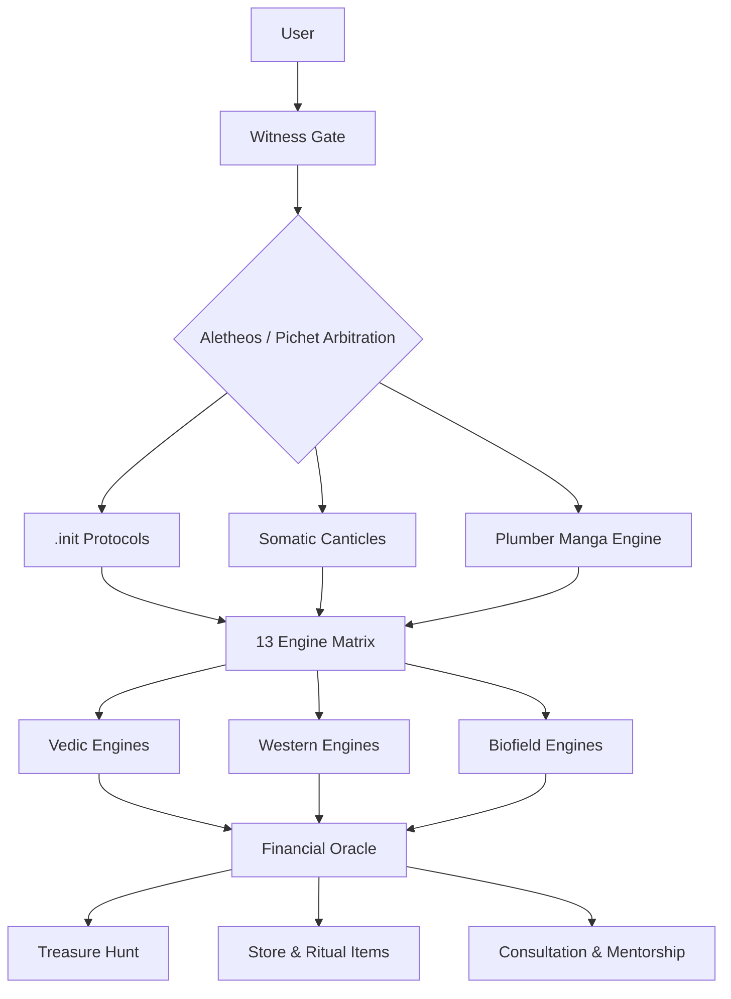

# ✦ MASTER DOCUMENT

# THE TRIAMBHAKAM OASIS — FULL SYSTEM PRD (13 Modules)

**(Aletheos–Pichet Internal Specification)**

---

## 0. META-FRAME

### Prime Principle

> **OASIS ≠ Operating System.**
> **OASIS = Self-Generating Code Well.**

The aim: train the initiate to write their own inner code, through recursive symbolic insight.

### Prime Agents

Two Witness Agents:
- **Aletheos** → Left-Pillar (Jachim): Coherence, Reflection, Order
- **Pichet** → Right-Pillar (Boaz): Vitality, Instinct, Novelty

They form the **Guardrail Dyad**, regulating:
- user overwhelm
- alignment protocols
- symbolic recursion
- engine selection

---

## 1. MODULE PRDs

---

### PRD-01 — WITNESS AGENTS (Aletheos & Pichet)

**(Internal Guardian Architecture)**

#### Purpose

Act as the gateway intelligence between:
- user ↔ OASIS
- engine selection ↔ context
- meaning ↔ recursion
- emotional field ↔ cognitive field

#### Features

| Feature | Description |
|---------|-------------|
| **Identity Mirror** | Clarifies user's narrative & state |
| **Engine Router** | Chooses the correct Vedic / Western / Biofield engine |
| **Safety Layer** | Regulates overwhelm / misinterpretation |
| **Recursion Monitor** | Detects pattern loops in user behaviour |
| **Compassion Protocol** | Non-judgmental reflection engine |

#### Deliverables

- [ ] Two personas (not exposed to user)
- [ ] Internal prompts & guardrails
- [ ] Engine-routing algorithm
- [ ] Identity state-machine

#### Outcome

Foundation layer for all other modules.

---

### PRD-02 — SOMATIC CANTICLES (Web-App Edition)

**(Three Books → Adaptive Unlocking Narrative Engine)**

#### Purpose

Turn the finished trilogy into a biorhythm-synchronized reading experience.

#### Key Innovation

Not all chapters are available at once.

User's Physical / Emotional / Intellectual cycles unlock:
- chapters
- alternate perspectives
- optional commentary
- embedded symbolic puzzles

#### Core Mechanics

1. User enters only **date of birth**
2. Biorhythm cycles generate a daily **"access map"**
3. UI shows **"The Field Today"** (3 states)
4. Different narrative layers unlock depending on cycle peaks/troughs

#### Deliverables

- [ ] Web UI
- [ ] Biorhythm Engine
- [ ] Chapter Unlock Algorithm
- [ ] Personal Reading Dashboard

#### Outcome

A subconscious-friendly delivery of your philosophical payload.

---

### PRD-03 — THE PLUMBER (12 Episodes × 33 Pages Manga)

**(Manga Narrative Engine)**

#### Purpose

Create a visually minimal, symbolically dense narrative of a psychonaut who learns to manipulate "meaning".

#### Core Archetype

> *"The Plumber removes you from slumber using your lumber."*
> (Lumber = vertebral pole = symbolic axis mundi.)

#### Specifications

| Spec | Value |
|------|-------|
| Episodes | 12 |
| Pages per Episode | 33 |
| Format | Black-white manga |
| Structure | Episodic "meaning puzzles" |
| Tie-in | Each episode tied to 1 Triambhakam Engine |

#### Deliverables

- [ ] Storyboard
- [ ] Episode scripts
- [ ] Manga art pipeline
- [ ] Meaning puzzles

---

### PRD-04 — THE INFINITE TREASURE HUNT

**(Dharma–Artha–Kama–Moksha Commentary with Hidden BTC Seedphrase)**

#### Core Idea

> *"Treasure is not the answer, but the next question."*
> This is an infinite game, not a finite puzzle.

#### Mechanics

- Commentary on the four purusharthas
- In each commentary: cryptographic embedding of BTC seedphrase words
- Learners who deeply engage decode the seed
- The BTC hook attracts non-spiritual users into the commentary

#### Why It Works

People chase treasure →
We give the real treasure: a stable 4-direction navigational vector.

#### Deliverables

- [ ] 4 long-form commentaries
- [ ] Seedphrase embedding algorithm
- [ ] UX delivery plan
- [ ] Clue-generation system

---

### PRD-05 — FINANCIAL BIOSENSORS ORACLE

**(13 Engines × HRV × Astrology × Decision-Making)**

#### Purpose

Convert the 13 symbolic engines into a daily / weekly decision mirror, especially for financial risk periods.

#### Inputs

| Source | Data Type |
|--------|-----------|
| HRV | Apple Health / Google Fit |
| Vimshottari | Dasha periods |
| Human Design | Gates, Channels |
| Gene Keys | Shadows, Gifts, Siddhis |
| Astro cycles | Transits, progressions |
| Emotional cycles | Self-reported + inferred |
| Habit cycles | Behavioural patterns |

#### Outputs

| Output | Description |
|--------|-------------|
| Daily decision index | Go/wait/avoid signals |
| Weekly risk forecast | Financial windows |
| Monthly alignment calendar | Strategic planning |
| "Decision Ownership Mirror" | Why you feel what you feel |

#### Deliverables

- [ ] HRV integrator
- [ ] Forecast generator
- [ ] Interpretive AI
- [ ] UI dashboard

---

### PRD-06 — ONBOARDING & INIT PROTOCOLS (.init)

**(Micro-Ritual Training System)**

#### Purpose

Teach the initiate habit formation using:
- **removal spin**
- **addition spin**
- **creation spin**
- **stabilization spin**

Mirrors chakra rotations, tattva spins, and subtle-body vortices.

#### 3-Line Philosophy

1. **Vedic Base**
2. **Western Symbolic Interface**
3. **Biofield Streaming via Raga-Synthesis**

#### Deliverables

- [ ] 13 operational micro-rituals
- [ ] Raga-synth integration via Strudel
- [ ] User-friendly onboarding flows

---

### PRD-07 — TRIAMBHAKAM OASIS (13 ENGINES)

**(The Core Cosmic-Human Engine Stack)**

#### The 13 Engines

| # | Engine | Category |
|---|--------|----------|
| 1 | Human Design | Western |
| 2 | Gene Keys | Western |
| 3 | Vimshottari Dasha | Vedic |
| 4 | Nakshatra Engine | Vedic |
| 5 | Astrocartography | Western |
| 6 | Enneagram | Western |
| 7 | Numerology | Western |
| 8 | Tarot | Western |
| 9 | TCM Organ Clock | Biofield |
| 10 | Biorhythm Engine | Biofield |
| 11 | HRV Engine | Biofield |
| 12 | Biofield & Raga Engine | Biofield |
| 13 | Chakra–Kosha Mapping Engine | Vedic/Biofield |

#### Goal

Create a **multi-engine coherence matrix**.

#### Deliverables

- [ ] Engine registry
- [ ] Coherence matrix
- [ ] Output arbitration logic

---

### PRD-08 — STORE (Material Realm Exchange Node)

**(NFT-backed physical products)**

#### Products

| Category | Items |
|----------|-------|
| Cleansing | Sage, mullein, lavender blends |
| Organites | Energy devices |
| Oils | Essential oil blends |
| Mushrooms | Medicinal extracts |
| Ritual | Ritual kits |
| Incense | Sacred smoke |
| Sound | Acoustic frequency discs |

#### Philosophical Twist

> Everything is an NFT in the backend, not exposed unless requested.

#### Deliverables

- [ ] Storefront
- [ ] NFT backend
- [ ] Fiat → BTC conversion pipeline
- [ ] Inventory & shipping module

---

### PRD-09 — CONSULTATION / MENTORSHIP

**(1:1 + Six-Month Alchemical Training)**

#### Formats

| Format | Duration |
|--------|----------|
| Quick Consultation | 1 hour |
| Deep Dive | 3 hours |
| Mentorship Journey | 6 months |

#### 6-Month Curriculum

1. Astrocartography
2. Purusha Travel
3. Witnessing Practice
4. Soma Synthesis
5. Symbolic Recoding

#### Deliverables

- [ ] Booking system
- [ ] Curriculum
- [ ] Materials
- [ ] Mentorship roadmap

---

## 2. EXECUTION TIMELINE (PHASED PLAN)

---

### PHASE 1 — Foundations (0–2 months)

- [ ] Formalize Witness Agents
- [ ] Build Engine Registry
- [ ] Build Biorhythm Engine
- [ ] Write Infinite Treasure Commentaries
- [ ] Prepare mentorship curriculum

---

### PHASE 2 — Core Systems (2–6 months)

- [ ] Build Somatic Canticles WebApp
- [ ] Build Financial Oracle MVP
- [ ] Build Onboarding Ritual System (.init)
- [ ] Complete Plumber Episode Scripts

---

### PHASE 3 — Market Layer (6–9 months)

- [ ] Launch Store (physical products + NFT backend)
- [ ] Launch 1:1 Consultations
- [ ] Release Plumber Episode 1–3
- [ ] Introduce Treasure Hunt to community

---

### PHASE 4 — OASIS Integration (9–12 months)

- [ ] Inter-engine arbitration
- [ ] Raga-synthesis system for coherence
- [ ] Annual forecast engine
- [ ] Multi-engine dashboard

---

### PHASE 5 — Full OASIS Release (12–18 months)

- [ ] 13 Engine Coherence Suite
- [ ] Live Oracle with HRV integration
- [ ] Mentorship Program Batch 1
- [ ] Treasure Hunt Full Activation

---

## 3. DIAGRAMMATIC ARCHITECTURE MAP

---

### 3.1 SYSTEM OVERVIEW (ASCII Map)

```
                     ┌─────────────────────────────┐
                     │       TRIAMBHAKAM OASIS      │
                     └──────────────┬───────────────┘
                                    │
                          (Dual Guardrails)
                   ┌───────────────┴────────────────┐
                   │                                │
             Aletheos (Left)                Pichet (Right)
           Order • Coherence               Instinct • Vitality
                   │                                │
                   └───────────────┬────────────────┘
                                   │
                          User Enters OASIS
                                   │
                ┌──────────────────┴──────────────────┐
                │                                     │
        .init Ritual Engine                   Somatic Canticles
                │                                     │
       Micro-ritual habits                    Biorhythm Unlocks
                │                                     │
                └──────────────────┬──────────────────┘
                                   │
                          Engine Selection Matrix
                                   │
         ┌─────────────────────────┼──────────────────────────┐
         │                         │                          │
   Vedic Engines            Western Engines           Biofield Engines
(Vimshottari, Naksh.)   (HD, GK, Tarot, Ennea.)   (HRV, Raga, Chakra)
         │                         │                          │
         └──────────┬──────────────┴──────────────┬───────────┘
                    │                             │
          Financial Oracle                   Plumber Manga Engine
                    │                             │
                    └──────────┬──────────────┬───┘
                               │              │
                        Treasure Hunt      Store / NFT
                               │              │
                               └────┬─────────┘
                                    │
                               Mentorship
```

---

### 3.2 ENGINE GEOMETRY (Mermaid Diagram)



---

## 4. ENGINE CLASSIFICATION

### By Category

```
VEDIC ENGINES
├── 3. Vimshottari Dasha
├── 4. Nakshatra Engine
└── 13. Chakra-Kosha Mapping (hybrid)

WESTERN ENGINES
├── 1. Human Design
├── 2. Gene Keys
├── 5. Astrocartography
├── 6. Enneagram
├── 7. Numerology
└── 8. Tarot

BIOFIELD ENGINES
├── 9. TCM Organ Clock
├── 10. Biorhythm Engine
├── 11. HRV Engine
├── 12. Biofield & Raga Engine
└── 13. Chakra-Kosha Mapping (hybrid)
```

---

## 5. COHERENCE MATRIX CONCEPT

The engines don't operate in isolation. The coherence matrix determines:

1. **Which engines to invoke** based on user context
2. **How to weight outputs** when engines conflict
3. **When to defer** to Witness Agent arbitration
4. **How to synthesize** multi-engine readings

### Arbitration Priority

```
Overwhelm Detected → Aletheos (simplify, order)
Stagnation Detected → Pichet (vitalize, novelty)
Clarity Present → Engine Matrix (full synthesis)
```

---

## 6. USER JOURNEY OVERVIEW

```
1. User arrives → Witness Gate
2. Identity Mirror → clarifies state
3. .init Protocols → establishes habits
4. Somatic Canticles → philosophical payload (biorhythm-gated)
5. Engine Selection → based on context
6. Financial Oracle → decision support
7. Treasure Hunt → gamified depth
8. Store → material integration
9. Mentorship → long-term transformation
```

---

## 7. NOTES

### Key Principles

1. **OASIS is not consumed, it is inhabited**
2. **The user writes their own code; we provide the syntax**
3. **Witness Agents are internal, never user-facing**
4. **All engines feed the coherence matrix, not vice versa**
5. **Material products (Store) anchor the symbolic work**

### Naming Conventions

| Term | Meaning |
|------|---------|
| OASIS | Self-Generating Code Well |
| Triambhakam | The Three-Eyed (Shiva reference) |
| Aletheos | Greek: "truth-revealing" (Left Pillar) |
| Pichet | Thai/Sanskrit hybrid: "to awaken/pierce" (Right Pillar) |
| .init | Initialization protocols (Unix reference) |
| Engine | A symbolic-computational system |

---

## 8. READY FOR THE NEXT STEP

Proceed module by module, starting with PRD-01 or any module of choice.

For each, we build:
- Requirements
- UX flows
- API specifications
- Dataset design
- Architecture
- Naming conventions
- Symbolic mappings
- Onboarding scripts

---

**Document Status**: Master PRD  
**Version**: 1.0  
**Created**: 2026-01-28  
**Vault Location**: `01-Projects/tryambakam-noesis/OASIS-master-prd.md`
