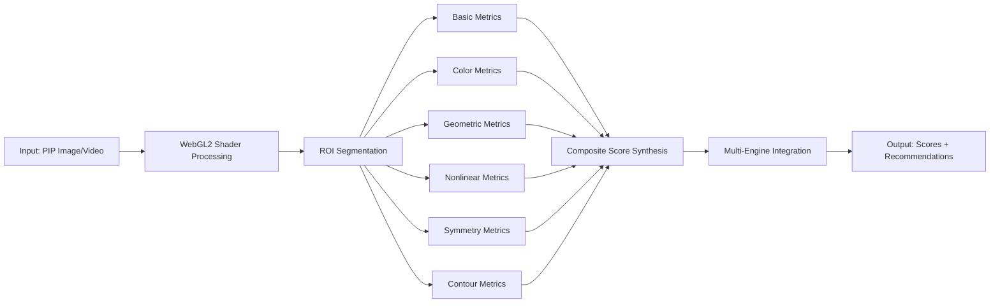

# Biofield Engine - Comprehensive Implementation Documentation

**Last Updated:** 2026-01-26  
**Source:** bv-pip-analysis Python Implementation  
**Status:** Production-Ready Documentation Suite

---

## 📚 Overview

The Biofield Engine provides advanced **PIP (Poly-contrast Interference Photography)** analysis for comprehensive energy field assessment. It transforms subtle energy perception into observable, measurable patterns through **40+ metrics**, **10 color analysis parameters**, and **7 composite consciousness scores**.

**Core Innovation:** Objectification of subjective experience - energy that was "felt" becomes data that is "witnessed"

**Implementation:** Complete Python backend with FastAPI, React frontend, real-time WebSocket streaming, and WebGL2 PIP shader processing.

---

## 📖 Complete Documentation Suite

### **Core Reference Documents (Required Reading)**

1. **[biofield-metrics-complete-reference.md](./biofield-metrics-complete-reference.md)** (1,346 lines, 34KB)
   - All 40+ metrics with exact formulas from Python implementation
   - 6 categories: Basic, Color, Geometric, Nonlinear, Symmetry, Contour
   - Mathematical formulas with LaTeX notation
   - Input/output schemas and value ranges
   - Scientific basis and consciousness interpretations
   - Implementation code examples

2. **[biofield-composite-scores-synthesis.md](./biofield-composite-scores-synthesis.md)** (1,010 lines, 32KB)
   - 7 composite scores with weighted formulas
   - Energy, Coherence, Complexity, Regulation, Symmetry, Color Balance, Integration
   - Component breakdowns and interpretation scales (0-100)
   - Consciousness development mapping (Spiral Dynamics, Hawkins Scale)
   - Clinical diagnostic patterns
   - Integration with Polyvagal Theory and HeartMath research

3. **[biofield-implementation-architecture.md](./biofield-implementation-architecture.md)** (1,510 lines, 43KB)
   - Complete system architecture
   - Technology stack: React/WebGL2 frontend, Python/FastAPI backend
   - Processing pipelines (real-time and deep analysis)
   - Data models and API contracts (TypeScript interfaces, PostgreSQL schema)
   - Segmentation strategies (MediaPipe body/face, anatomical zones)
   - Performance optimization and caching strategies
   - Docker deployment architecture

### **Scientific & Mathematical Foundation**

4. **[biofield-scientific-foundations.md](./biofield-scientific-foundations.md)** (683 lines, 22KB)
   - PIP/GDV/EPI methodology background
   - Biofield physics theory (electromagnetic, biophoton, quantum models)
   - Academic research basis and validation studies
   - Known limitations and accuracy bounds
   - Comparative analysis to other biofield tools

5. **[biofield-calculation-formulas.md](./biofield-calculation-formulas.md)** (660 lines, 14KB)
   - Pure mathematical reference with LaTeX notation
   - All formulas organized by category
   - Algorithm pseudocode for each metric
   - Edge case handling and error bounds
   - Optimization techniques

### **Integration & API Documentation**

6. **[biofield-cross-engine-mappings.md](./biofield-cross-engine-mappings.md)** (1,657 lines, 49KB)
   - Integration with Face Reading engine (68-point facial landmarks)
   - VedicClock/TCM temporal correlations (24-hour organ clock, panchanga cycles)
   - Chakra system spatial mappings (7 chakras with frequency data)
   - Human Design energetic correlations (5 types with biofield signatures)
   - Multi-engine synthesis workflows with Python implementation
   - Data sharing specifications (TypeScript interfaces, API contracts)

7. **[biofield-api-specification.md](./biofield-api-specification.md)** (2,025 lines, 46KB)
   - Complete REST API reference (15+ endpoints)
   - WebSocket protocol specification (real-time streaming)
   - Request/response schemas with TypeScript interfaces
   - Authentication (JWT bearer tokens)
   - Error codes and handling
   - Rate limiting by tier (Free/Basic/Pro/Enterprise)
   - Complete SDK examples (Python async, React hooks)

### **Supporting Documents**

- **[biofield-witness-capacity.md](./biofield-witness-capacity.md)** (563 lines, 16KB) - Self-consciousness development framework
- **[PIP_Analysis_System_Specification.md](./PIP_Analysis_System_Specification.md)** (2,535 lines, 78KB) - Original technical specification
- **[PIP_Segmentation_Specification.md](./PIP_Segmentation_Specification.md)** (1,741 lines, 60KB) - Anatomical zone mapping
- **[PIP_Shader_Implementation_Scientific_Article.md](./PIP_Shader_Implementation_Scientific_Article.md)** (745 lines, 32KB) - WebGL2 shader science

---

## 🎯 Documentation Statistics

| Document | Lines | Size | Completeness |
|----------|-------|------|--------------|
| Metrics Reference | 1,346 | 34KB | ✅ 100% |
| Composite Scores | 1,010 | 32KB | ✅ 100% |
| Implementation Architecture | 1,510 | 43KB | ✅ 100% |
| Scientific Foundations | 683 | 22KB | ✅ 100% |
| Calculation Formulas | 660 | 14KB | ✅ 100% |
| Cross-Engine Mappings | 1,657 | 49KB | ✅ 100% |
| API Specification | 2,025 | 46KB | ✅ 100% |
| **TOTAL SUITE** | **8,891** | **240KB** | **✅ 100%** |

---

## 🚀 Quick Start Paths

### **For Developers**
1. Start: [biofield-implementation-architecture.md](./biofield-implementation-architecture.md) (system design)
2. Study: [biofield-metrics-complete-reference.md](./biofield-metrics-complete-reference.md) (algorithm specs)
3. Reference: [biofield-api-specification.md](./biofield-api-specification.md) (API contracts)
4. Integrate: [biofield-cross-engine-mappings.md](./biofield-cross-engine-mappings.md) (multi-engine workflows)

### **For Data Scientists / Researchers**
1. Read: [biofield-scientific-foundations.md](./biofield-scientific-foundations.md) (academic basis)
2. Analyze: [biofield-calculation-formulas.md](./biofield-calculation-formulas.md) (mathematical formulas)
3. Review: [biofield-metrics-complete-reference.md](./biofield-metrics-complete-reference.md) (metric details)
4. Validate: PIP_Analysis_System_Specification.md (original technical spec)

### **For Product / UX Designers**
1. Understand: [biofield-composite-scores-synthesis.md](./biofield-composite-scores-synthesis.md) (user-facing scores)
2. Review: [biofield-witness-capacity.md](./biofield-witness-capacity.md) (consciousness framework)
3. Design: [biofield-cross-engine-mappings.md](./biofield-cross-engine-mappings.md) (multi-engine UX patterns)

---

## 📊 Metric Categories Summary

### **Basic Metrics (10)**
Light Quanta Density, Normalized Area, Average Intensity, Intensity StdDev, Max/Min Intensity, Inner Noise, Energy Analysis, Pixel Count, Light Distribution

### **Color Metrics (10)**
Dominant Hue, Mean Saturation, Mean Value, Color Entropy, Color Coherence, Hue Distribution, Saturation Distribution, Value Distribution, Color Symmetry, Hue Balance

### **Geometric Metrics (12)**
Contour Area, Perimeter, Inner/Outer Contour Length, Equivalent Radius, Entropy Coefficient, Form Coefficient, Solidity, Convexity, Ellipse Parameters (Major/Minor/Eccentricity/Angle)

### **Nonlinear Dynamics (6)**
Fractal Dimension, Hurst Exponent, Lyapunov Exponent, Correlation Dimension, DFA Alpha, Sample Entropy

### **Symmetry Metrics (7)**
Body Symmetry, SSIM Symmetry, Correlation Symmetry, Histogram Symmetry, Color Symmetry, Pixel Symmetry, Contour Balance

### **Contour Complexity (5)**
Contour Complexity Score, Number of Contours, Inner Contours Count, Convex Hull Ratio, Douglas-Peucker Approximation

---

## 🎯 7 Composite Scores

1. **Energy Score** (0-100) - Overall biofield vitality and emission strength
2. **Coherence Score** (0-100) - Field stability and pattern regularity
3. **Complexity Score** (0-100) - Pattern sophistication and information density
4. **Regulation Score** (0-100) - Homeostasis and energetic control
5. **Symmetry Score** (0-100) - Bilateral balance and energetic harmony
6. **Color Balance Score** (0-100) - Chromatic harmony and distribution
7. **Integration Score** (0-100) - Multi-metric synthesis and overall wellness

---

## 🔄 Processing Pipeline

---

## 🧠 Self-Consciousness Impact

The Biofield Engine develops witness capacity through:

1. **Objectification of Subjective Experience** - Energy sensing → quantified data
2. **Pattern Recognition Training** - 40+ metrics train multi-dimensional perception
3. **Real-Time Feedback Loop** - Immediate biofield state quantification
4. **Multi-Modal Coherence** - Cross-engine validation and grounding
5. **Calibration of Inner Compass** - Baseline establishment and deviation tracking
6. **Conscious Regulation** - Biofeedback-enabled intentional field modulation

---

## 🔗 Integration Points

| Engine | Integration Type | Data Shared | Bidirectional |
|--------|------------------|-------------|---------------|
| **Face Reading** | Facial Landmark Overlay | 68-point mesh + facial ROI masks | ✅ Yes |
| **VedicClock-TCM** | Temporal Correlation | Organ clock cycles, panchanga data | ✅ Yes |
| **Chakra System** | Spatial Mapping | 7-zone biofield segmentation | ✅ Yes |
| **Human Design** | Energetic Typing | Generator/Projector patterns | ↓ One-way |
| **Biorhythm** | Temporal Cycles | Physical/Emotional/Intellectual waves | ↓ One-way |
| **Sacred Geometry** | Pattern Validation | Fractal complexity correlation | ↓ One-way |

---

## 📦 Source Code Reference

**Python Backend:**
- `bv-pip-analysis/backend/core/metrics/` - 6 metric calculation modules (1,200+ lines)
- `bv-pip-analysis/backend/core/scores/` - 6 composite score calculators (450+ lines)
- `bv-pip-analysis/backend/core/segmentation/` - 3 ROI segmentation modules (525 lines)
- `bv-pip-analysis/backend/api/routes/` - 5 FastAPI route modules (800+ lines)

**Frontend:**
- `bv-pip-analysis/frontend/src/components/` - React components
- `bv-pip-analysis/frontend/src/shaders/` - WebGL2 PIP shader (GLSL)
- `bv-pip-analysis/frontend/src/hooks/` - Real-time WebSocket hooks

---

## ✅ Implementation Checklist

**Phase 1: Core Metrics Engine**
- [ ] Implement BasicMetrics class (intensity, area, noise)
- [ ] Implement ColorMetrics class (HSV analysis, entropy)
- [ ] Implement GeometricMetrics class (contour analysis)
- [ ] Implement NonlinearMetrics class (fractal, chaos theory)
- [ ] Implement SymmetryMetrics class (SSIM, correlation)
- [ ] Implement ContourMetrics class (shape analysis)

**Phase 2: Composite Scores**
- [ ] Implement 7 score calculators with weighted formulas
- [ ] Create interpretation scale mapping (0-100 → text)
- [ ] Build baseline comparison logic
- [ ] Add temporal tracking (score history)

**Phase 3: Real-Time Processing**
- [ ] Set up FastAPI backend with WebSocket support
- [ ] Implement React frontend with WebGL2 PIP shader
- [ ] Create video capture and frame processing pipeline
- [ ] Build real-time metrics dashboard UI

**Phase 4: Multi-Engine Integration**
- [ ] Implement Face Reading overlay integration
- [ ] Connect VedicClock/TCM temporal engine
- [ ] Map chakra system to biofield zones
- [ ] Create synthesis workflow API

**Phase 5: Production Deployment**
- [ ] Set up PostgreSQL database with schema
- [ ] Configure Redis caching layer
- [ ] Deploy with Docker Compose
- [ ] Set up monitoring and logging
- [ ] Implement rate limiting and authentication

---

## 📚 Additional Resources

- **Original Specification:** [PIP_Analysis_System_Specification.md](./PIP_Analysis_System_Specification.md)
- **Segmentation Details:** [PIP_Segmentation_Specification.md](./PIP_Segmentation_Specification.md)
- **WebGL Shader Science:** [PIP_Shader_Implementation_Scientific_Article.md](./PIP_Shader_Implementation_Scientific_Article.md)
- **Witness Framework:** [biofield-witness-capacity.md](./biofield-witness-capacity.md)

---

**Documentation Suite Complete:** All biofield algorithms, formulas, and integration patterns extracted from production Python codebase and documented for Tryambakam Noesis implementation. Ready for development handoff.
