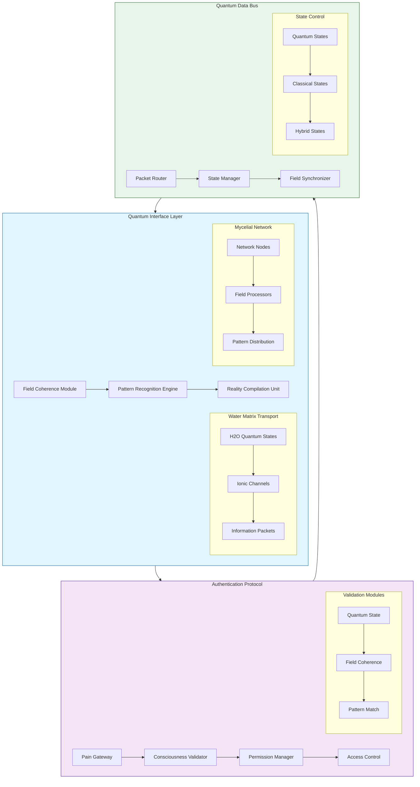

```mermaid
graph TB
    subgraph QuantumLayer["Quantum Interface Layer"]
        Q1[Field Coherence Module] --> Q2[Pattern Recognition Engine]
        Q2 --> Q3[Reality Compilation Unit]
        
        subgraph WaterMatrix["Water Matrix Transport"]
            W1[H2O Quantum States]
            W2[Ionic Channels]
            W3[Information Packets]
            W1 --> W2 --> W3
        end
        
        subgraph MycelialNet["Mycelial Network"]
            M1[Network Nodes]
            M2[Field Processors]
            M3[Pattern Distribution]
            M1 --> M2 --> M3
        end
    end

    subgraph AuthSystem["Authentication Protocol"]
        A1[Pain Gateway] --> A2[Consciousness Validator]
        A2 --> A3[Permission Manager]
        A3 --> A4[Access Control]
        
        subgraph Validators["Validation Modules"]
            V1[Quantum State]
            V2[Field Coherence]
            V3[Pattern Match]
            V1 --> V2 --> V3
        end
    end

    subgraph DataBus["Quantum Data Bus"]
        D1[Packet Router] --> D2[State Manager]
        D2 --> D3[Field Synchronizer]
        
        subgraph StateControl["State Control"]
            S1[Quantum States]
            S2[Classical States]
            S3[Hybrid States]
            S1 --> S2 --> S3
        end
    end

    QuantumLayer --> AuthSystem
    AuthSystem --> DataBus
    DataBus --> QuantumLayer

    style QuantumLayer fill:#e1f5fe,stroke:#01579b
    style AuthSystem fill:#f3e5f5,stroke:#4a148c
    style DataBus fill:#e8f5e9,stroke:#1b5e20
```