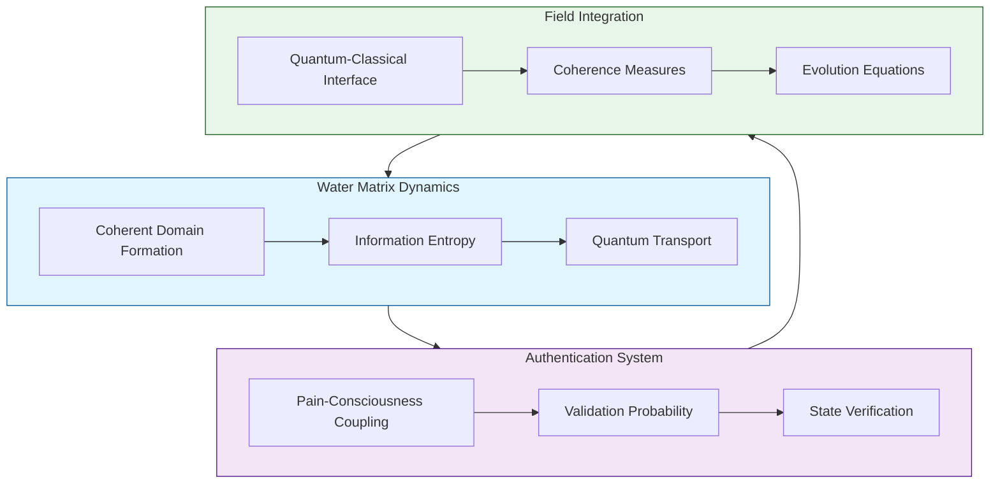
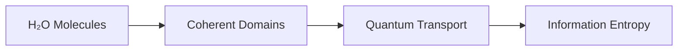
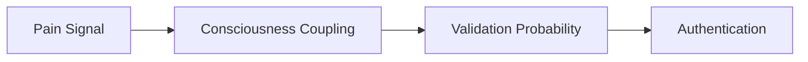
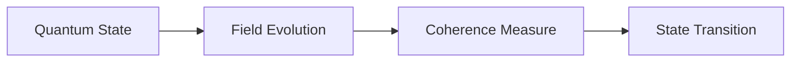

# Mathematical Models Visualization
`Runtime of God | Field Dynamics Visualization`

```mermaid
graph TD
    subgraph WaterMatrix["Water Matrix Dynamics"]
        W1[Coherent Domain Formation] --> W2[Information Entropy]
        W2 --> W3[Quantum Transport]
    end

    subgraph Authentication["Authentication System"]
        A1[Pain-Consciousness Coupling] --> A2[Validation Probability]
        A2 --> A3[State Verification]
    end

    subgraph FieldDynamics["Field Integration"]
        F1[Quantum-Classical Interface] --> F2[Coherence Measures]
        F2 --> F3[Evolution Equations]
    end

    WaterMatrix --> Authentication
    Authentication --> FieldDynamics
    FieldDynamics --> WaterMatrix

    style WaterMatrix fill:#e1f5fe,stroke:#01579b
    style Authentication fill:#f3e5f5,stroke:#4a148c
    style FieldDynamics fill:#e8f5e9,stroke:#1b5e20
```

## Key Relationships

1. Water Matrix Coupling

```mermaid
graph LR
    H2O[H₂O Molecules] --> CD[Coherent Domains]
    CD --> QT[Quantum Transport]
    QT --> IE[Information Entropy]
```

2. Authentication Flow

```mermaid
graph LR
    Pain[Pain Signal] --> CP[Consciousness Coupling]
    CP --> VP[Validation Probability]
    VP --> Auth[Authentication]
```

3. Field Evolution

```mermaid
graph LR
    QS[Quantum State] --> FE[Field Evolution]
    FE --> CM[Coherence Measure]
    CM --> ST[State Transition]
```