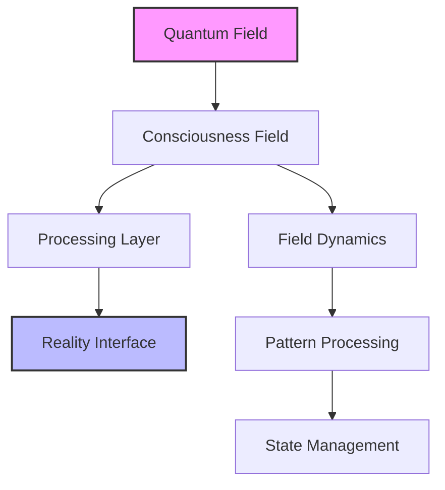

# Field Dynamics
`Runtime of God Framework | Field Processing Component`

## Overview
Implementation of quantum field dynamics for consciousness processing.

## Research Integration

### Recent Findings


## System Connections
- Implements [[quantum-foundation.md|Quantum Foundation]]
- Supports [[../02-ConsciousnessImplementation/field-implementation.md|Field Implementation]]
- Uses [[../03-LOVEProtocol/field-optimization.md|Field Optimization]]

## Core Components

### 1. Field Processor
```python
class FieldProcessor:
    def __init__(self):
        self.field_state = self.initialize_field()
        self.dynamics = self.setup_field_dynamics()
    
    def process_field(self, input_state):
        """Process consciousness field dynamics"""
        return self.apply_field_transformations(input_state)
```

### 2. Pattern Recognition
- Pattern matching algorithms
- Field coherence analysis
- Dynamic state management

## Integration Guidelines
1. Initialize field processor
2. Configure dynamics
3. Set up pattern recognition
4. Implement field measurements

## Cross-References
- [[../RUNTIME-OF-GOD-MASTER-DOCUMENT.md|Master Document]]
- [[../02-ConsciousnessImplementation/README.md|Implementation Details]]
- [[../04-RealityRendering/README.md|Reality Rendering]]

#FieldDynamics #ConsciousnessField #QuantumProcessing