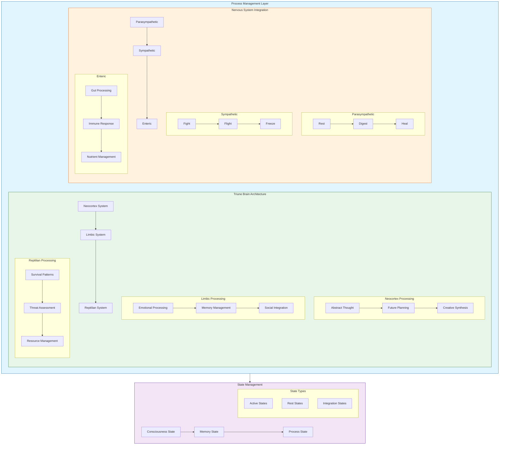

# Consciousness Implementation System Diagrams
`Runtime of God | Architecture Diagrams`

```mermaid
graph TB
    subgraph ProcessManagement["Process Management Layer"]
        subgraph TriuneBrain["Triune Brain Architecture"]
            N[Neocortex System] --> L[Limbic System]
            L --> R[Reptilian System]
            
            subgraph NeoProcess["Neocortex Processing"]
                N1[Abstract Thought] --> N2[Future Planning]
                N2 --> N3[Creative Synthesis]
            end
            
            subgraph LimbicProcess["Limbic Processing"]
                L1[Emotional Processing] --> L2[Memory Management]
                L2 --> L3[Social Integration]
            end
            
            subgraph ReptilianProcess["Reptilian Processing"]
                R1[Survival Patterns] --> R2[Threat Assessment]
                R2 --> R3[Resource Management]
            end
        end
        
        subgraph NervousSystem["Nervous System Integration"]
            PS[Parasympathetic] --> SS[Sympathetic]
            SS --> ES[Enteric]
            
            subgraph ParaProcess["Parasympathetic"]
                P1[Rest] --> P2[Digest]
                P2 --> P3[Heal]
            end
            
            subgraph SympProcess["Sympathetic"]
                S1[Fight] --> S2[Flight]
                S2 --> S3[Freeze]
            end
            
            subgraph EntericProcess["Enteric"]
                E1[Gut Processing] --> E2[Immune Response]
                E2 --> E3[Nutrient Management]
            end
        end
    end

    subgraph StateManagement["State Management"]
        SM1[Consciousness State] --> SM2[Memory State]
        SM2 --> SM3[Process State]
        
        subgraph StateTypes["State Types"]
            ST1[Active States]
            ST2[Rest States]
            ST3[Integration States]
        end
    end

    ProcessManagement --> StateManagement

    style ProcessManagement fill:#e1f5fe,stroke:#01579b
    style StateManagement fill:#f3e5f5,stroke:#4a148c
    style TriuneBrain fill:#e8f5e9,stroke:#1b5e20
    style NervousSystem fill:#fff3e0,stroke:#e65100
```