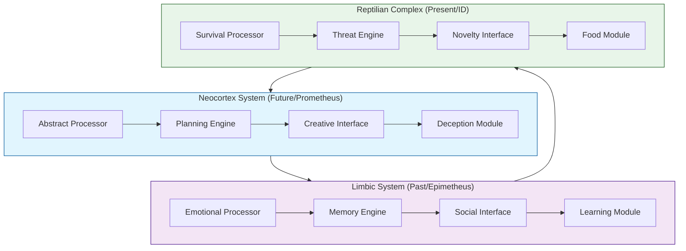

# Triune Brain Architecture & Three-Body Integration
`Runtime of God | Consciousness Implementation`

## System Architecture Overview

### 1. Triune Processing Units


### 2. Three Nervous Systems Integration
```javascript
nervousSystemArchitecture = {
    parasympathetic: {
        mode: "rest_and_digest",
        timing: "slow",
        functions: ["healing", "recovery", "maintenance"],
        stateControl: "conservation"
    },
    sympathetic: {
        mode: "fight_or_flight",
        timing: "fast",
        functions: ["mobilization", "defense", "action"],
        stateControl: "activation"
    },
    enteric: {
        mode: "gut_brain",
        timing: "autonomous",
        functions: ["digestion", "absorption", "immunity"],
        stateControl: "regulation"
    }
}
```

## Implementation Framework

### 1. Consciousness State Machine
```typescript
interface ConsciousnessState {
    reptilian: {
        survivalState: "novel" | "threat" | "food";
        reflexResponse: boolean;
        presentAwareness: number;
    };
    limbic: {
        emotionalState: EmotionalSignature;
        memoryAccess: MemoryBlock[];
        socialContext: SocialSignature;
    };
    neocortex: {
        abstractThought: AbstractPattern[];
        futureProjection: TimelineProject[];
        creativeSynthesis: CreativeOutput[];
    };
}
