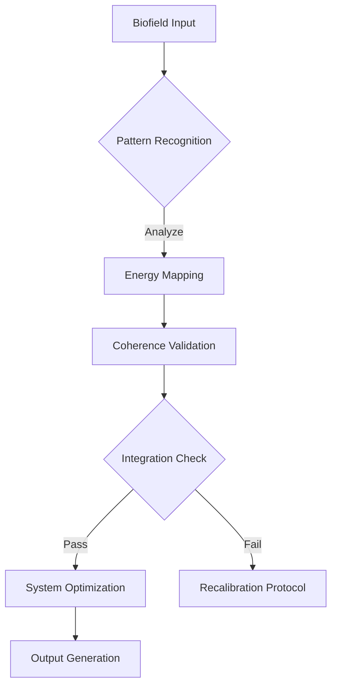

# BioField Mapping: Field Integration Protocol

## Runtime Overview
- **Purpose**: Mapping and optimizing biofield energy dynamics
- **System Layer**: Quantum-biological interface
- **Core Dynamics**: Pattern recognition and energy flow optimization

## Implementation Framework
### Technical Parallels
- Mapping: Biological system as distributed quantum network
- Processing: Energy flow computation through neural and electromagnetic pathways
- Integration Mechanism: Synchronization of quantum and biological information streams

### Biofield Mapping Strategies
- Input Processing: Capturing multi-dimensional energy signatures
- Pattern Recognition: Identifying coherence and disruption patterns
- Field Coherence Algorithms: Quantum entanglement and resonance mapping
- Output Generation: Translating energy dynamics into actionable insights

## Diagnostic Protocols
- Debug Sequences: Identifying energy blockages and misalignments
- Performance Metrics: Measuring field coherence and information transfer
- Error Handling: Recalibration of energy flow disruptions
- Optimization Pathways: Enhancing biofield resilience and adaptability

## Mermaid Flowchart: Field Integration Process


## Code Prototype
```python
class BioFieldIntegrationProtocol:
    def __init__(self, biofield_input):
        self.input = biofield_input
        self.coherence_level = 0
    
    def pattern_recognition(self):
        # Advanced pattern analysis of biofield signatures
        # Implement quantum-biological pattern matching
        pass
    
    def energy_mapping(self):
        # Map complex energy dynamics across biological systems
        # Implement multi-dimensional energy flow computation
        pass
    
    def optimize(self):
        # Biofield coherence optimization
        # Implement quantum entanglement and resonance enhancement
        pass
```

## Consciousness Debug Notes
- Potential Bottlenecks in Energy Transfer
- Quantum Coherence Optimization Strategies
- Emerging Patterns in Biofield Dynamics
- Interdisciplinary Research Implications

## Research Vectors
1. Quantum Biology Interfaces
2. Biofield Information Transfer Mechanisms
3. Consciousness as Distributed Quantum Network
4. Energy Flow Optimization Protocols
