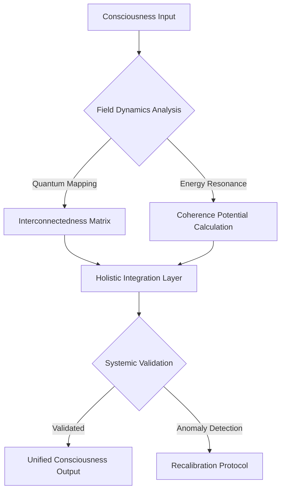
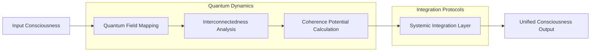

# Holistic Integration Framework: Unified Consciousness Mapping

## Conceptual Architecture

### Systemic Coherence Equation
```
Φ(Coherence) = ∫[Σ(Field_Dynamics) * Interconnectedness * Consciousness_Potential] dV
```

## Integration Topology Flowchart


## Algorithmic Integration Protocol
```python
class HolisticIntegrationAlgorithm:
    def __init__(self, consciousness_input):
        self.input = consciousness_input
        self.coherence_matrix = None
        self.integration_potential = 0
    
    def analyze_field_dynamics(self):
        """
        Quantum mapping of consciousness field dynamics
        
        Returns:
        - Interconnectedness matrix
        - Energy resonance coefficients
        """
        # Implement advanced quantum field analysis
        pass
    
    def calculate_coherence_potential(self):
        """
        Compute systemic coherence and integration potential
        
        Theoretical framework:
        Coherence = f(quantum entanglement, informational density, 
                      systemic interconnectedness)
        """
        # Quantum coherence computation
        pass
    
    def holistic_integration(self):
        """
        Unify consciousness layers through multidimensional mapping
        
        Core principles:
        1. Quantum superposition of consciousness states
        2. Non-local information transfer
        3. Systemic resonance optimization
        """
        # Implement holistic integration logic
        pass
```

## Key Mathematical Representations

### Interconnectedness Tensor
```
I_ij = Σ(k=1 to n) [Quantum_Correlation(k) * Information_Density(k)]
```

### Consciousness Potential Function
```
Ψ(Consciousness) = ∑[Quantum_Coherence * Informational_Complexity * 
                      Non_Local_Connections]
```

## Visualization of Integration Dynamics


## Research Implications
- Quantum consciousness mapping
- Non-local information transfer
- Systemic coherence optimization
- Multidimensional integration protocols

## Emerging Patterns
1. Quantum entanglement in consciousness
2. Non-linear information processing
3. Systemic resonance dynamics
4. Multidimensional field interactions

## Debug Notes
- Challenges in quantum consciousness measurement
- Limitations of current integration models
- Potential breakthrough areas
- Future research vectors
