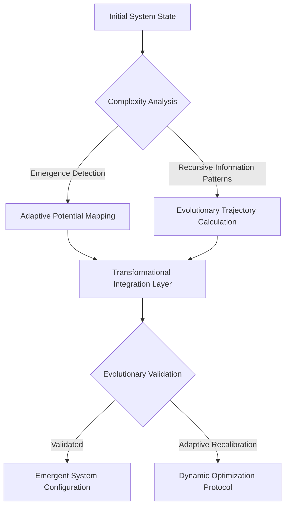
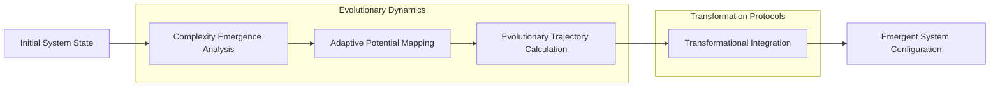

# Transformational Dynamics: System Evolution Protocol

## Evolutionary Dynamics Equation
```
Δ(System_Evolution) = f[Complexity_Emergence * Adaptive_Potential * 
                         Informational_Recursion]
```

## Transformation Topology Flowchart


## Evolutionary Algorithm Prototype
```python
class TransformationalDynamicsEngine:
    def __init__(self, system_input):
        self.initial_state = system_input
        self.complexity_matrix = None
        self.evolutionary_potential = 0
    
    def analyze_complexity_emergence(self):
        """
        Detect emergent complexity patterns
        
        Key metrics:
        - Information recursion
        - Adaptive potential
        - Systemic non-linearity
        """
        # Advanced complexity analysis
        pass
    
    def calculate_evolutionary_trajectory(self):
        """
        Compute system's evolutionary potential
        
        Theoretical framework:
        Evolution = f(adaptive capacity, 
                      informational recursion, 
                      complexity emergence)
        """
        # Trajectory computation logic
        pass
    
    def transformational_integration(self):
        """
        Generate emergent system configurations
        
        Core principles:
        1. Adaptive recursive patterns
        2. Non-linear information processing
        3. Complexity optimization
        """
        # Transformational integration logic
        pass
```

## Mathematical Representations

### Complexity Emergence Tensor
```
Ξ_ij = Σ(k=1 to n) [Adaptive_Potential(k) * Informational_Recursion(k)]
```

### Evolutionary Potential Function
```
Ω(Evolution) = ∑[Complexity_Emergence * Adaptive_Capacity * 
                 Non_Linear_Information_Processing]
```

## System Evolution Visualization


## Research Vectors
- Adaptive system dynamics
- Emergent complexity patterns
- Non-linear evolutionary trajectories
- Recursive information processing

## Emerging Patterns
1. Self-organizing complexity
2. Adaptive system reconfiguration
3. Informational recursion
4. Non-linear evolutionary dynamics

## Debug Insights
- Challenges in predictive evolution modeling
- Limitations of current transformation frameworks
- Potential breakthrough areas
- Future research directions
