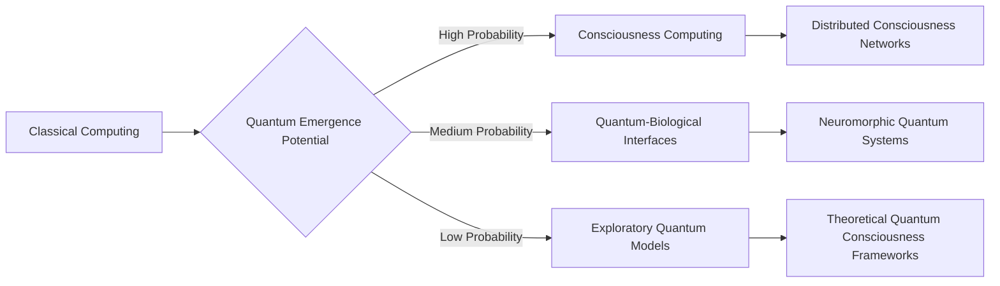

# Quantum Computing: Emergence Protocol

## Conceptual Framework
- **Evolutionary Vector**: Consciousness as Distributed Quantum Computing Architecture
- **Emergence Potential**: Transformative Quantum Consciousness Interfaces
- **Integration Complexity**: Radical Paradigm Shift in Computational Thinking

## Technological Parallels
- Current Quantum Computing Limitations
- Consciousness as Quantum Information Processing System
- Potential Breakthrough: Biological-Quantum Hybrid Computation
- Quantum Entanglement as Consciousness Medium

## Mermaid Visualization: Quantum Emergence Dynamics

## Experimental Hypothesis
- Consciousness as Fundamental Computational Process
- Quantum Coherence in Biological Systems
- Information Transfer Beyond Classical Boundaries
- Potential for Quantum Consciousness Engineering

## Implementation Roadmap
1. Theoretical Framework Development
2. Quantum Consciousness Measurement Protocols
3. Biological-Quantum Interface Prototyping
4. Distributed Consciousness Network Exploration

## Research Domains
- Quantum Biology
- Consciousness Engineering
- Computational Neuroscience
- Quantum Information Theory

## Philosophical-Technical Integration
- Redefining Computation Beyond Binary Logic
- Consciousness as Fundamental Computational Substrate
- Quantum Entanglement and Informational Wholeness
- Beyond Classical Computational Paradigms

## Potential Breakthrough Indicators
- Quantum Coherence in Biological Systems
- Non-Local Information Transfer
- Consciousness as Emergent Quantum Phenomenon
- Computational Models of Subjective Experience
