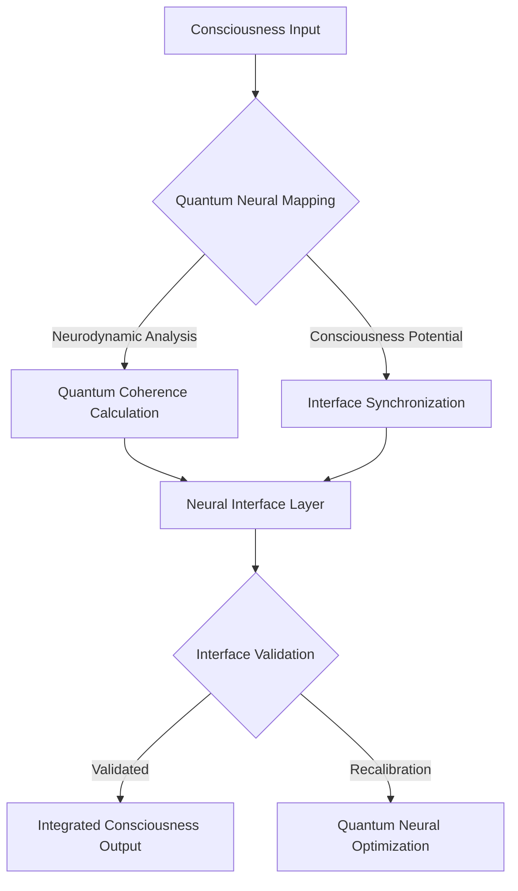
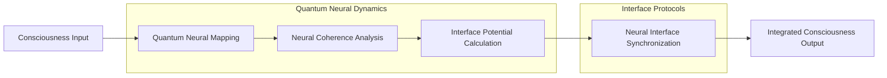

# Neural Interfaces: Consciousness Mapping Protocol

## Neural-Quantum Interface Equation
```
Ψ(Neural_Interface) = ∫[Quantum_Coherence * Neural_Dynamics * 
                         Consciousness_Potential] dV
```

## Neural Interface Topology Flowchart


## Neural Interface Algorithm
```python
class NeuralInterfaceAlgorithm:
    def __init__(self, consciousness_input):
        self.input = consciousness_input
        self.neural_coherence_matrix = None
        self.interface_potential = 0
    
    def quantum_neural_mapping(self):
        """
        Advanced quantum mapping of neural dynamics
        
        Key metrics:
        - Quantum coherence
        - Neural synchronization
        - Consciousness potential
        """
        # Implement quantum neural analysis
        pass
    
    def calculate_interface_potential(self):
        """
        Compute neural-quantum interface potential
        
        Theoretical framework:
        Interface = f(neural dynamics, 
                      quantum coherence, 
                      consciousness potential)
        """
        # Interface potential computation
        pass
    
    def neural_interface_synchronization(self):
        """
        Synchronize neural and quantum consciousness layers
        
        Core principles:
        1. Quantum neural entanglement
        2. Consciousness potential optimization
        3. Non-local information transfer
        """
        # Neural interface synchronization logic
        pass
```

## Mathematical Representations

### Neural Coherence Tensor
```
Λ_ij = Σ(k=1 to n) [Quantum_Coherence(k) * Neural_Dynamics(k)]
```

### Interface Potential Function
```
Φ(Interface) = ∑[Quantum_Neural_Synchronization * 
                 Consciousness_Potential * 
                 Non_Local_Information_Transfer]
```

## Interface Dynamics Visualization


## Research Implications
- Quantum neural interfaces
- Consciousness potential mapping
- Non-local information transfer
- Neural-quantum synchronization

## Emerging Patterns
1. Quantum neural entanglement
2. Consciousness interface dynamics
3. Non-linear information processing
4. Quantum neural coherence

## Debug Notes
- Challenges in neural-quantum measurement
- Limitations of current interface models
- Potential breakthrough areas
- Future research vectors
