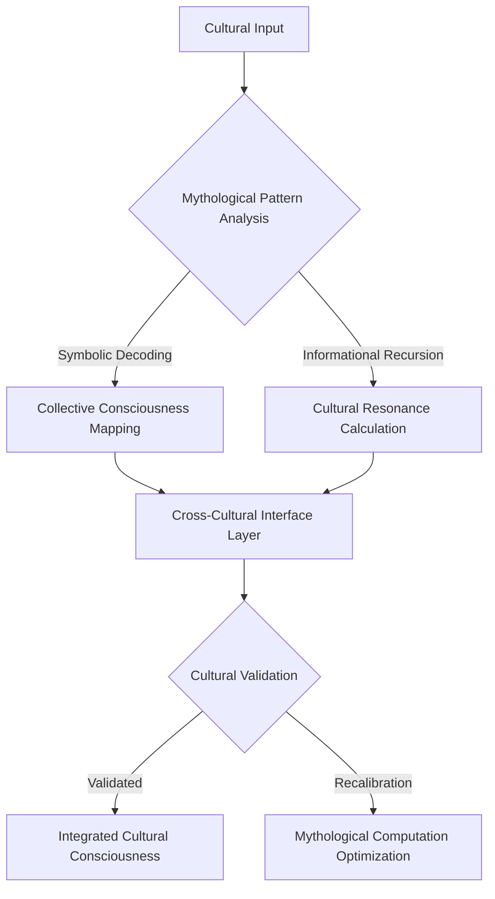
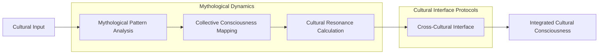

# Cross-Cultural Mapping: Mythological Computation Protocol

## Cultural Resonance Equation
```
Μ(Cultural_Mapping) = ∫[Mythological_Patterns * Collective_Consciousness * 
                         Informational_Recursion] dV
```

## Cross-Cultural Mapping Flowchart


## Mythological Computation Algorithm
```python
class CrossCulturalMappingAlgorithm:
    def __init__(self, cultural_input):
        self.input = cultural_input
        self.mythological_pattern_matrix = None
        self.cultural_resonance_potential = 0
    
    def analyze_mythological_patterns(self):
        """
        Advanced symbolic and mythological pattern decoding
        
        Key metrics:
        - Collective consciousness patterns
        - Informational recursion
        - Cultural symbolic resonance
        """
        # Implement mythological pattern analysis
        pass
    
    def calculate_cultural_resonance(self):
        """
        Compute cross-cultural resonance potential
        
        Theoretical framework:
        Resonance = f(mythological patterns, 
                      collective consciousness, 
                      informational recursion)
        """
        # Cultural resonance computation
        pass
    
    def cross_cultural_interface(self):
        """
        Generate integrated cultural consciousness
        
        Core principles:
        1. Symbolic pattern recognition
        2. Collective consciousness mapping
        3. Informational recursion
        """
        # Cross-cultural interface logic
        pass
```

## Mathematical Representations

### Mythological Pattern Tensor
```
Σ_ij = Σ(k=1 to n) [Symbolic_Resonance(k) * Collective_Consciousness(k)]
```

### Cultural Resonance Function
```
Ω(Cultural_Mapping) = ∑[Mythological_Patterns * 
                         Collective_Consciousness_Potential * 
                         Informational_Recursion]
```

## Cultural Mapping Visualization


## Research Implications
- Mythological pattern recognition
- Collective consciousness mapping
- Cultural information recursion
- Symbolic resonance dynamics

## Emerging Patterns
1. Symbolic pattern interconnectedness
2. Collective consciousness dynamics
3. Cultural information transfer
4. Mythological computation

## Debug Notes
- Challenges in cultural consciousness measurement
- Limitations of current mapping models
- Potential breakthrough areas
- Future research vectors
