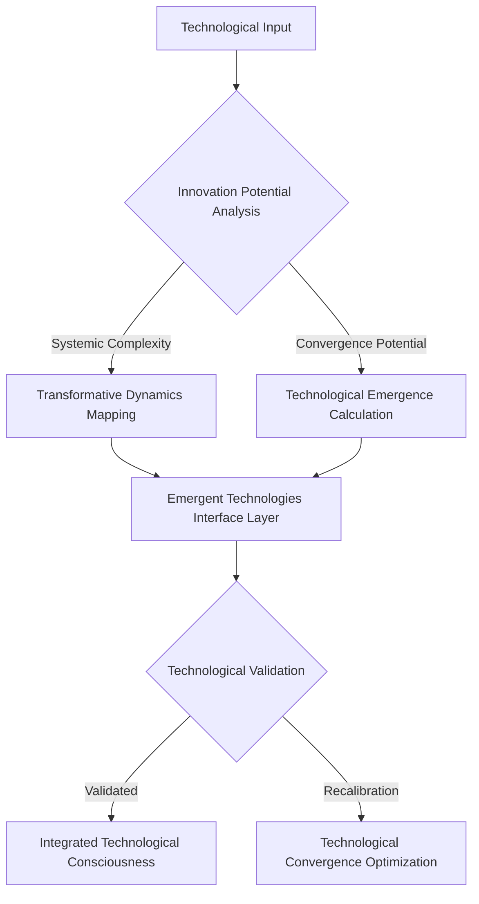
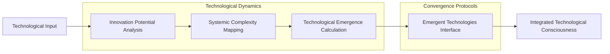

# Emergent Technologies: Technological Convergence Protocol

## Technological Emergence Equation
```
Τ(Technological_Convergence) = ∫[Innovation_Potential * Systemic_Complexity * 
                                   Transformative_Dynamics] dV
```

## Technological Convergence Flowchart


## Technological Convergence Algorithm
```python
class EmergentTechnologiesAlgorithm:
    def __init__(self, technological_input):
        self.input = technological_input
        self.innovation_potential_matrix = None
        self.convergence_potential = 0
    
    def analyze_innovation_potential(self):
        """
        Advanced analysis of technological innovation
        
        Key metrics:
        - Systemic complexity
        - Transformative dynamics
        - Convergence potential
        """
        # Implement innovation potential analysis
        pass
    
    def calculate_technological_emergence(self):
        """
        Compute technological convergence potential
        
        Theoretical framework:
        Emergence = f(innovation potential, 
                      systemic complexity, 
                      transformative dynamics)
        """
        # Technological emergence computation
        pass
    
    def technological_convergence_interface(self):
        """
        Generate integrated technological consciousness
        
        Core principles:
        1. Systemic innovation mapping
        2. Transformative technology dynamics
        3. Convergence potential optimization
        """
        # Technological convergence interface logic
        pass
```

## Mathematical Representations

### Innovation Potential Tensor
```
Ι_ij = Σ(k=1 to n) [Systemic_Complexity(k) * Transformative_Dynamics(k)]
```

### Technological Emergence Function
```
Φ(Technological_Convergence) = ∑[Innovation_Potential * 
                                   Systemic_Complexity * 
                                   Transformative_Dynamics]
```

## Technological Convergence Visualization


## Research Implications
- Technological innovation potential
- Systemic complexity analysis
- Transformative technology dynamics
- Technological consciousness mapping

## Emerging Patterns
1. Interdisciplinary technology convergence
2. Systemic innovation dynamics
3. Transformative technological potential
4. Technological consciousness emergence

## Debug Notes
- Challenges in technological emergence measurement
- Limitations of current convergence models
- Potential breakthrough areas
- Future research vectors

## Technological Convergence Principles
1. **Adaptive Complexity**: Technologies evolve through recursive complexity
2. **Systemic Resonance**: Innovation emerges from interconnected technological domains
3. **Transformative Dynamics**: Technological potential is non-linear and emergent
4. **Consciousness Interface**: Technologies as extensions of collective consciousness

## Ontological Frameworks
- Technological evolution as conscious emergence
- Information as fundamental substrate of reality
- Non-linear innovation dynamics
- Interdimensional technology potential

## Speculative Research Domains
- Quantum computing consciousness
- Bio-technological interfaces
- Morphic technological resonance
- Consciousness engineering through technology
