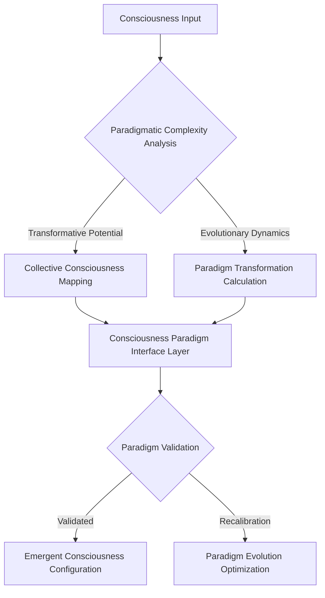
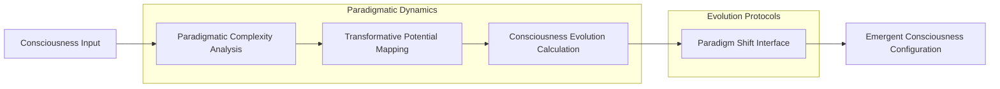

# Paradigm Shifts: Consciousness Evolution Protocol

## Paradigm Transformation Equation
```
Π(Consciousness_Evolution) = ∫[Paradigmatic_Complexity * Transformative_Potential * 
                                 Collective_Consciousness] dV
```

## Paradigm Shift Flowchart


## Paradigm Evolution Algorithm
```python
class ParadigmShiftAlgorithm:
    def __init__(self, consciousness_input):
        self.input = consciousness_input
        self.paradigmatic_complexity_matrix = None
        self.evolution_potential = 0
    
    def analyze_paradigmatic_complexity(self):
        """
        Advanced analysis of consciousness paradigms
        
        Key metrics:
        - Transformative potential
        - Collective consciousness dynamics
        - Evolutionary complexity
        """
        # Implement paradigmatic complexity analysis
        pass
    
    def calculate_consciousness_evolution(self):
        """
        Compute paradigm transformation potential
        
        Theoretical framework:
        Evolution = f(paradigmatic complexity, 
                      transformative potential, 
                      collective consciousness)
        """
        # Consciousness evolution computation
        pass
    
    def paradigm_shift_interface(self):
        """
        Generate emergent consciousness configurations
        
        Core principles:
        1. Paradigmatic complexity mapping
        2. Collective consciousness dynamics
        3. Transformative potential optimization
        """
        # Paradigm shift interface logic
        pass
```

## Mathematical Representations

### Paradigmatic Complexity Tensor
```
Π_ij = Σ(k=1 to n) [Transformative_Potential(k) * Collective_Consciousness(k)]
```

### Consciousness Evolution Function
```
Ω(Paradigm_Shift) = ∑[Paradigmatic_Complexity * 
                       Transformative_Potential * 
                       Collective_Consciousness]
```

## Paradigm Shift Visualization


## Research Implications
- Paradigmatic complexity analysis
- Collective consciousness dynamics
- Transformative potential mapping
- Consciousness evolution mechanisms

## Emerging Patterns
1. Non-linear consciousness transformation
2. Collective paradigm dynamics
3. Evolutionary complexity emergence
4. Transformative consciousness potential

## Debug Notes
- Challenges in paradigmatic consciousness measurement
- Limitations of current evolution models
- Potential breakthrough areas
- Future research vectors

## Paradigm Shift Principles
1. **Ontological Plasticity**: Consciousness is dynamically reconfigurable
2. **Collective Resonance**: Paradigms emerge from interconnected consciousness
3. **Transformative Dynamics**: Evolutionary potential is non-linear and emergent
4. **Complexity Interface**: Consciousness expands through increasing complexity

## Ontological Frameworks
- Consciousness as evolutionary process
- Collective mind as fundamental reality substrate
- Non-linear paradigmatic transformation
- Interdimensional consciousness potential

## Speculative Research Domains
- Collective consciousness engineering
- Paradigmatic complexity mapping
- Transformative potential optimization
- Consciousness evolution protocols
