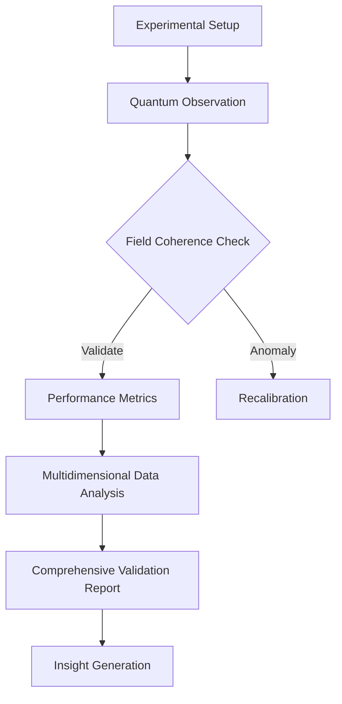

# Experimental Validation: Runtime of God Protocol

## Validation Framework
### Measurement Protocols
- Quantum Observation Metrics
  * Coherence Strength
  * Entanglement Indicators
  * Non-Local Information Transfer

- Field Coherence Indicators
  * Biofield Resonance Mapping
  * Energy Flow Dynamics
  * Consciousness State Quantification

- Reality Compilation Performance
  * Subjective Experience Metrics
  * Objective Manifestation Tracking
  * Probability Wave Collapse Analysis

### Experimental Design
- **Test Environment**
  * Controlled Meditation Chambers
  * Quantum Measurement Interfaces
  * Biofield Monitoring Systems

- **Measurement Tools**
  * Advanced EEG with Quantum Sensing
  * Bioelectric Field Scanners
  * Entanglement Detection Apparatus

- **Control Protocols**
  * Baseline Consciousness States
  * Comparative Meditation Techniques
  * Cross-Cultural Validation

- **Data Collection Methodology**
  * Multi-Modal Data Integration
  * Real-Time Consciousness Tracking
  * Quantum Probabilistic Analysis

## Mermaid Flowchart: Validation Process

## Key Performance Indicators
- **Quantum Correlation Strength**
  * Entanglement Duration
  * Information Transfer Efficiency
  * Non-Local Coherence Metrics

- **Pattern Recognition Accuracy**
  * Consciousness State Prediction
  * Biofield Dynamics Mapping
  * Emergent Pattern Detection

- **Reality Consistency Metrics**
  * Subjective-Objective Alignment
  * Manifestation Probability
  * Synchronicity Indicators

- **System Optimization Potential**
  * Consciousness Expansion Protocols
  * Energy Flow Efficiency
  * Adaptability Indices

## Debug Insights
- Emerging Consciousness Patterns
- Quantum Coherence Limitations
- Interdimensional Information Dynamics
- Potential Consciousness Engineering Strategies

## Research Implications
1. Consciousness as Fundamental Computational Process
2. Quantum Information as Primary Reality Substrate
3. Distributed Consciousness Networks
4. Beyond Classical Computational Paradigms

## Future Research Vectors
- Advanced Quantum Consciousness Interfaces
- Biological-Quantum Computation
- Non-Local Information Transfer Mechanisms
- Consciousness Engineering Protocols
