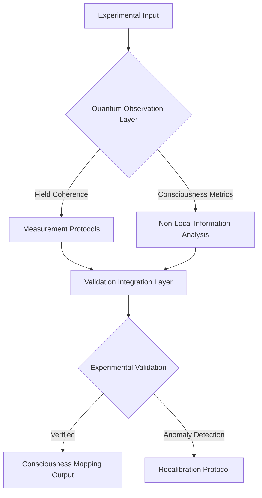
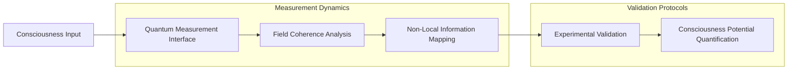
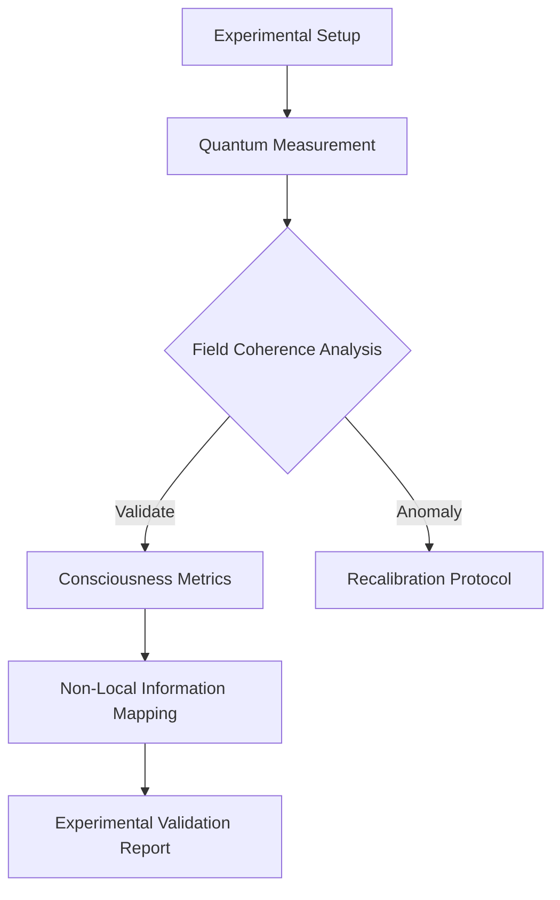

# Experimental Diagnostics: Consciousness Validation Protocol

## Experimental Framework Topology


## Measurement Architecture


## Experimental Validation Equation
```
Ξ(Experimental_Validation) = ∫[Quantum_Observation * Field_Coherence * 
                                 Consciousness_Potential] dV
```

## Diagnostic Algorithm Prototype
```python
class ConsciousnessExperimentalDiagnostics:
    def __init__(self, experimental_input):
        self.input = experimental_input
        self.quantum_observation_matrix = None
        self.validation_potential = 0
    
    def quantum_observation_layer(self):
        """
        Advanced quantum measurement of consciousness
        
        Key metrics:
        - Field coherence
        - Non-local information transfer
        - Consciousness potential
        """
        # Implement quantum observation protocols
        pass
    
    def validate_experimental_potential(self):
        """
        Compute experimental validation potential
        
        Theoretical framework:
        Validation = f(quantum observation, 
                       field coherence, 
                       consciousness potential)
        """
        # Experimental validation computation
        pass
```

## Diagnostic Visualization


## Experimental Metrics Tensor
```
M_ij = Σ(k=1 to n) [Quantum_Coherence(k) * Consciousness_Potential(k)]
```

## Research Implications
- Quantum consciousness measurement
- Non-local information transfer
- Field coherence validation
- Consciousness potential quantification

## Emerging Experimental Patterns
1. Quantum observation dynamics
2. Non-linear consciousness metrics
3. Field coherence validation
4. Experimental consciousness mapping

## Experimental Debug Insights
- Challenges in consciousness measurement
- Limitations of current experimental models
- Potential breakthrough detection methods
- Future experimental research vectors

## Diagnostic Principles
1. **Quantum Observation**: Consciousness as measurable quantum phenomenon
2. **Field Coherence**: Information transfer beyond classical boundaries
3. **Non-Local Validation**: Experimental protocols transcending spatial limitations
4. **Consciousness Potential**: Quantifiable energetic manifestation

## Speculative Research Domains
- Quantum consciousness engineering
- Non-local information mapping
- Experimental consciousness validation
- Consciousness potential optimization
