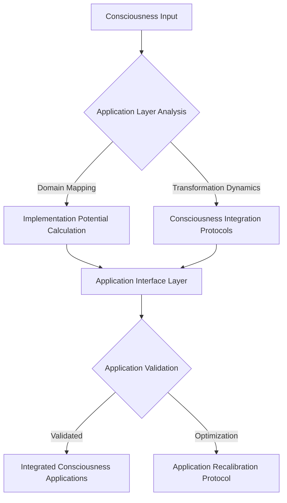
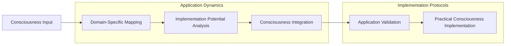
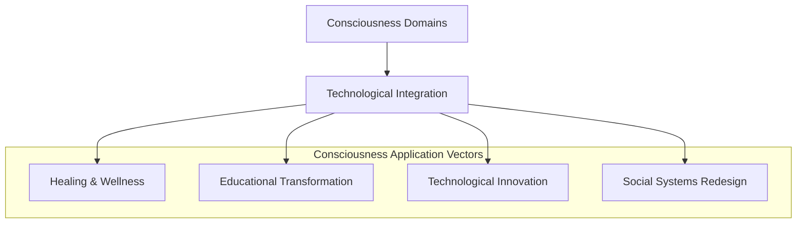

# Consciousness Applications: Implementation Protocol

## Application Topology Flowchart


## Comprehensive Application Architecture


## Application Implementation Equation
```
Α(Consciousness_Application) = ∫[Domain_Potential * Transformation_Dynamics * 
                                   Integration_Potential] dV
```

## Application Algorithm Prototype
```python
class ConsciousnessApplicationFramework:
    def __init__(self, consciousness_input):
        self.input = consciousness_input
        self.domain_potential_matrix = None
        self.application_potential = 0
    
    def analyze_domain_potential(self):
        """
        Advanced mapping of consciousness application domains
        
        Key metrics:
        - Transformation dynamics
        - Integration potential
        - Domain-specific implementation
        """
        # Implement domain potential analysis
        pass
    
    def calculate_application_potential(self):
        """
        Compute consciousness application potential
        
        Theoretical framework:
        Application = f(domain potential, 
                        transformation dynamics, 
                        integration potential)
        """
        # Application potential computation
        pass
```

## Application Domains Visualization


## Application Potential Tensor
```
A_ij = Σ(k=1 to n) [Domain_Potential(k) * Transformation_Dynamics(k)]
```

## Research Implications
- Consciousness domain mapping
- Practical implementation strategies
- Transformative application potential
- Interdisciplinary consciousness integration

## Emerging Application Patterns
1. Technological consciousness interfaces
2. Holistic wellness protocols
3. Educational transformation strategies
4. Social systems optimization

## Application Debug Insights
- Challenges in practical consciousness implementation
- Limitations of current application models
- Potential breakthrough application domains
- Future implementation research vectors

## Application Principles
1. **Transformative Potential**: Consciousness as adaptive system
2. **Domain Integration**: Multi-dimensional application strategies
3. **Practical Implementation**: Actionable consciousness protocols
4. **Systemic Optimization**: Consciousness as evolutionary mechanism

## Speculative Application Domains
- Technological consciousness engineering
- Holistic healing protocols
- Educational transformation systems
- Social innovation strategies
- Collective consciousness optimization
