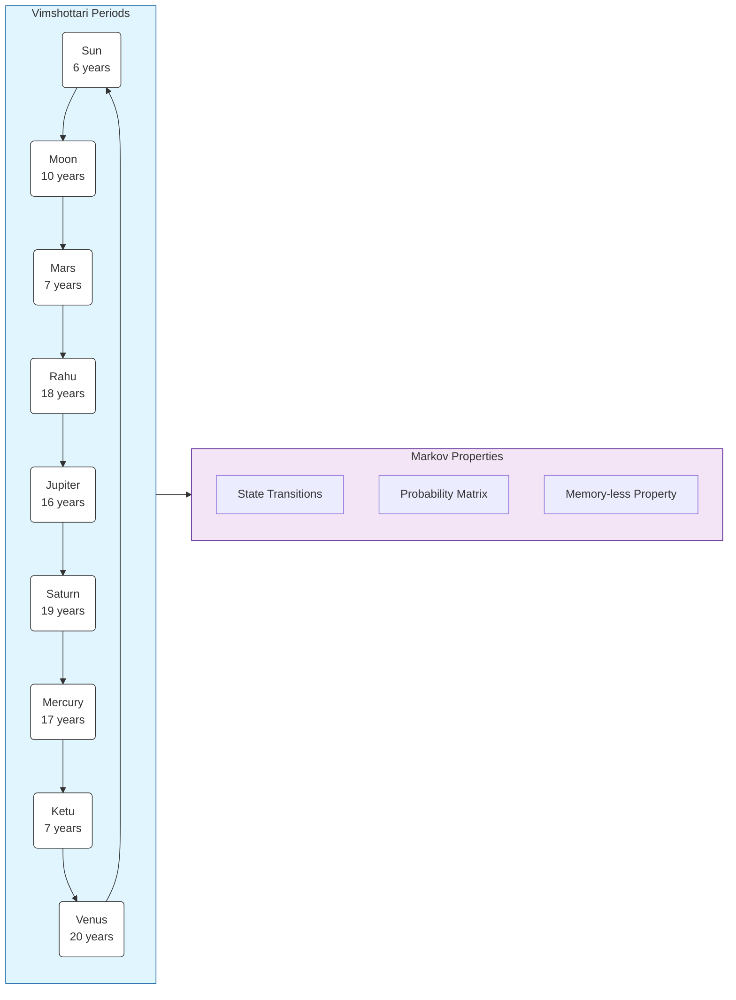

# Vimshottari Dasha - Markov Chain Mapping
`Version 1.0.0 | System Visualization`

## System Map

```mermaid
graph LR
    subgraph DashaPeriods["Vimshottari Periods"]
        Su(Sun<br>6 years) --> Mo(Moon<br>10 years)
        Mo --> Ma(Mars<br>7 years)
        Ma --> Ra(Rahu<br>18 years)
        Ra --> Ju(Jupiter<br>16 years)
        Ju --> Sa(Saturn<br>19 years)
        Sa --> Me(Mercury<br>17 years)
        Me --> Ke(Ketu<br>7 years)
        Ke --> Ve(Venus<br>20 years)
        Ve --> Su
    end

    subgraph MarkovStates["Markov Properties"]
        P1[State Transitions]
        P2[Probability Matrix]
        P3[Memory-less Property]
    end

    DashaPeriods --> MarkovStates

    style DashaPeriods fill:#e1f5fe,stroke:#01579b
    style MarkovStates fill:#f3e5f5,stroke:#4a148c
    
    classDef planet fill:#fff,stroke:#333
    class Su,Mo,Ma,Ra,Ju,Sa,Me,Ke,Ve planet
```

## Related Documents
- [[System-Integration]]
- [[Technical-Implementation]]
