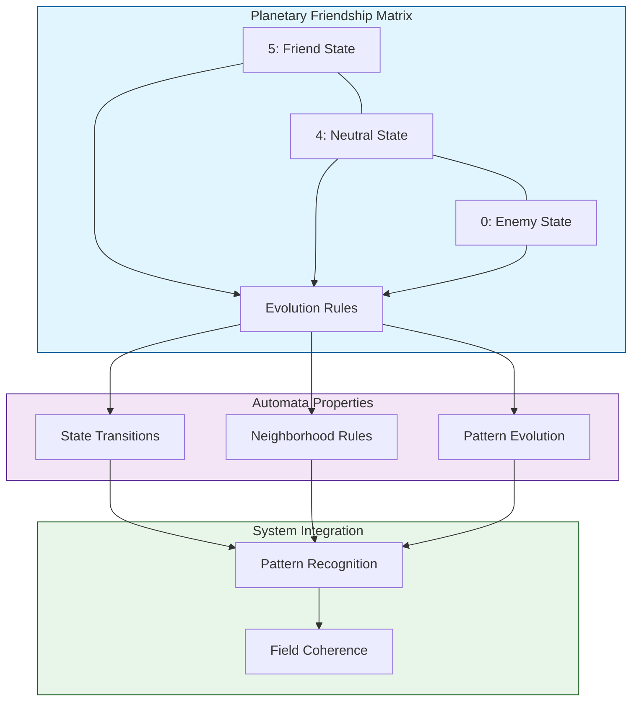

# Graha Friendship - Cellular Automata Mapping
`Version 1.0.0 | System Visualization`

## System Map

## Matrix Visualization Key
- 5 (Friend): Strong positive interaction
- 4 (Neutral): Balanced state
- 0 (Enemy): Strong negative interaction

## Related Documents
- [[System-Integration]]
- [[Technical-Implementation]]
