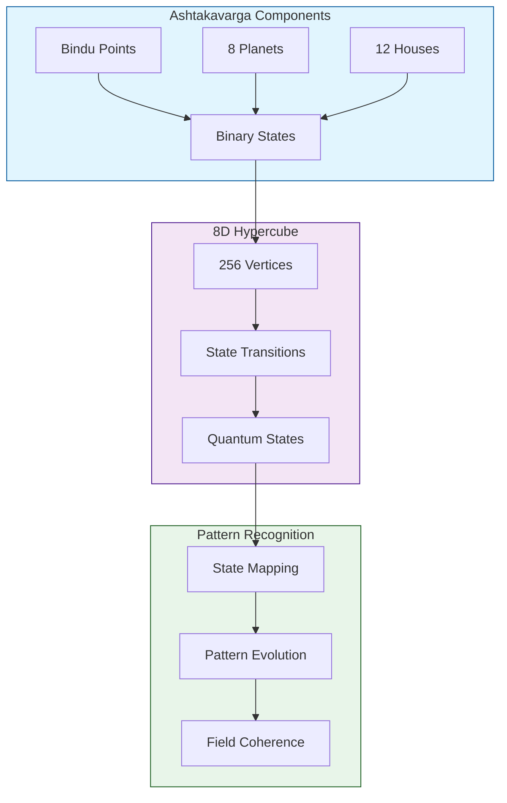

# Ashtakavarga - Hypercube Mapping
`Version 1.0.0 | System Visualization`

## System Map

## Geometric Interpretation
- Each bindu point represents a vertex in 8D space
- State transitions follow hypercube edges
- Pattern recognition tracks through vertex paths

## Related Documents
- [[System-Integration]]
- [[Technical-Implementation]]
