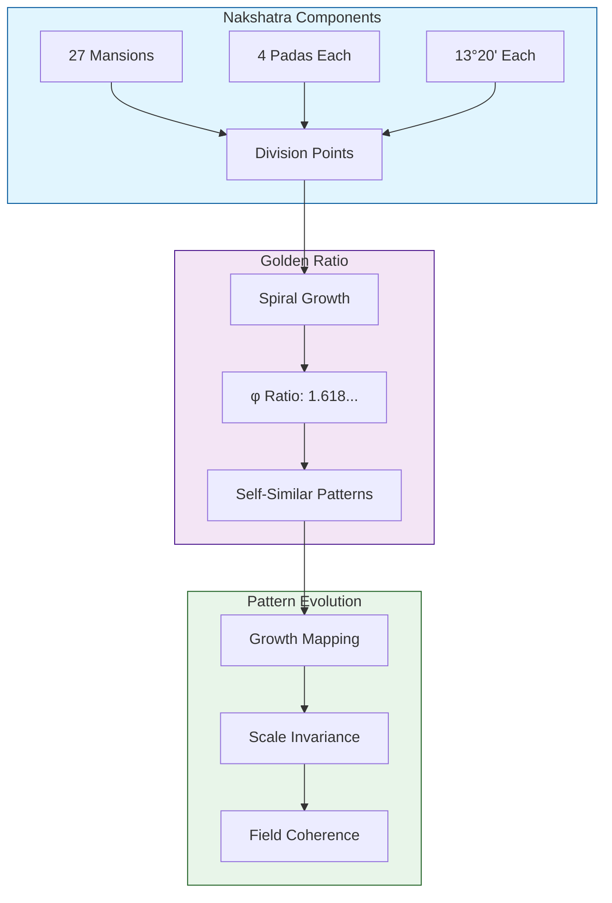

# Nakshatra - Fibonacci Spiral Mapping
`Version 1.0.0 | System Visualization`

## System Map

## Spiral Properties
- Golden angle: 137.5°
- Continuous growth pattern
- Self-similar at different scales
- Natural evolution mapping

## Related Documents
- [[System-Integration]]
- [[Technical-Implementation]]
