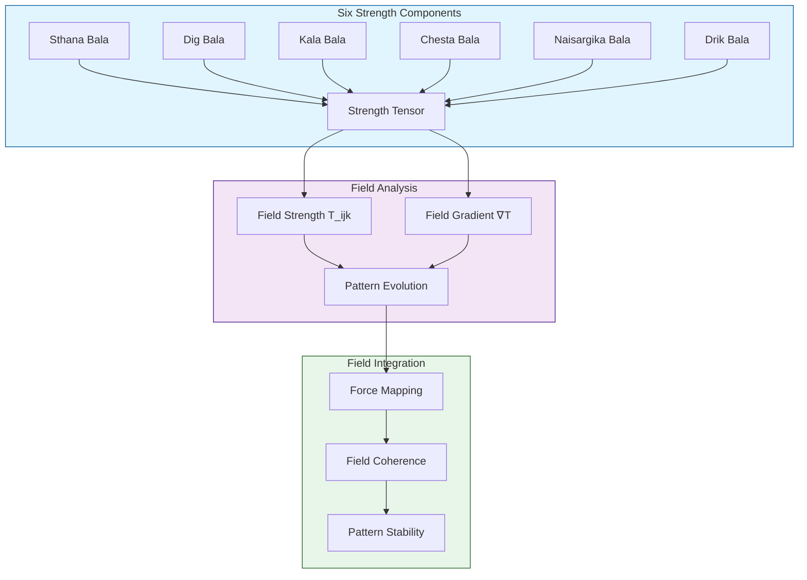

# Shadbala - Tensor Field Mapping
`Version 1.0.0 | System Visualization`

## System Map

## Tensor Components
- T₀₀₀: Positional strength
- T₁₁₁: Directional strength
- T₂₂₂: Temporal strength
- Cross-components: Interaction terms

## Related Documents
- [[System-Integration]]
- [[Technical-Implementation]]
