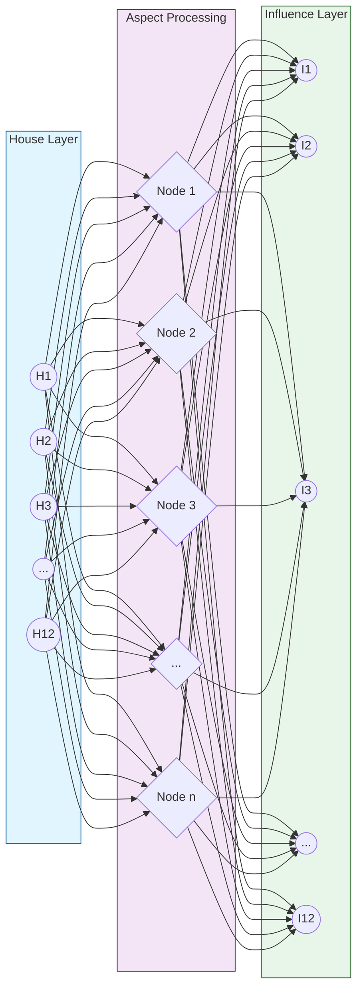

# Bhava Aspect - Neural Network Mapping
`Version 1.0.0 | System Visualization`

## System Map

## Network Properties
- Input: 12 house positions
- Hidden: Aspect processing layers
- Output: Influence patterns
- Weights: Aspect strengths

## Related Documents
- [[System-Integration]]
- [[Technical-Implementation]]
