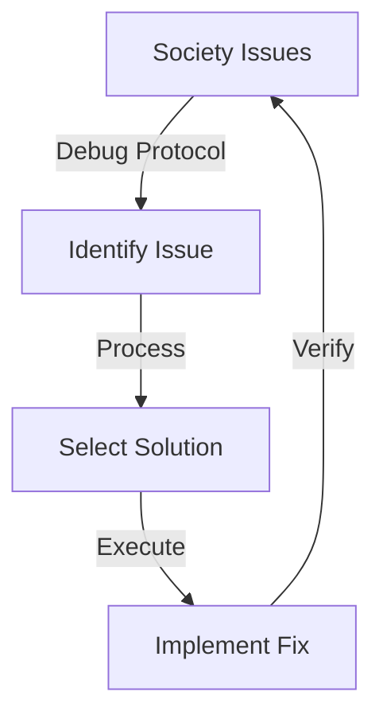

# Historical Debugging Practices Reference
## Ancient to Modern Technical Parallels

### Ancient Debug Protocols
1. **Pharmacos Ritual**
   ```javascript
   class SocietalDebug {
     executePharmacosProtocol() {
       // Ancient system maintenance
       selectScapegoat();
       purifySystem();
       exportProblem();
     }
   }
   ```

2. **Mercury Symbolism**
   - Cross: Error handling
   - Circle: Process loop
   - Horns: Exception throwing

3. **Bali Padiyami Pattern**
   ```javascript
   class AncestralDebug {
     async debugFamily() {
       await initializeRitual();
       processKarma();
       clearCache();
     }
   }
   ```

### Modern Parallels
1. System Maintenance
   - Ancient: Ritual cleansing
   - Modern: System updates
   - Quantum: Consciousness reset

2. Error Handling
   - Ancient: Sacrificial practices
   - Modern: Exception handling
   - Quantum: Shadow integration

### Implementation Patterns


## Technical-Historical Tags
- #ancient-debugging
- #system-maintenance
- #ritual-protocols
- #consciousness-reset
- #error-handling

## Related Documents
- [[Sacred-Runtime-Ancient-Debugging]]
- [[Unix-Guide-to-Consciousness]]
- [[Reality-Compile-Ancient-Source]]