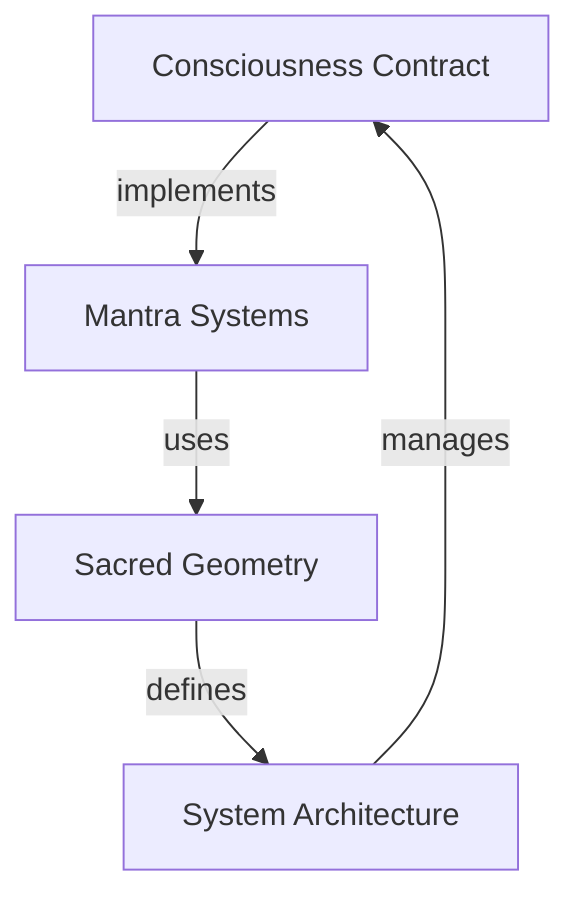

# Technical Reference Guide
## Consciousness Programming Concepts

### Smart Contract Models
```javascript
// Base consciousness contract template
class ConsciousnessContract {
  constructor() {
    this.state = 'initialized';
    this.permissions = new Permissions();
  }
  
  // Core methods
  async elevate() {}
  async debug() {}
  async optimize() {}
}
```

### System Architecture Patterns
1. Processing Nodes
   - Triangle patterns
   - Energy transformation
   - State changes

2. Boundary Definitions
   - Circle implementations
   - Scope definition
   - Container patterns

3. Execution Points
   - Bindu centering
   - Core processing
   - State management

### Implementation Protocols
1. System Preparation
2. Contract Deployment
3. Response Monitoring

## Cross-Reference Map


## Technical Tags
- #system-architecture
- #consciousness-programming
- #smart-contracts
- #sacred-geometry
- #implementation-protocols

## Related Documents
- [[Reality-Compile-Ancient-Source]]
- [[Unix-Guide-to-Consciousness]]
- [[Sacred-Geometry-Mathematics]]