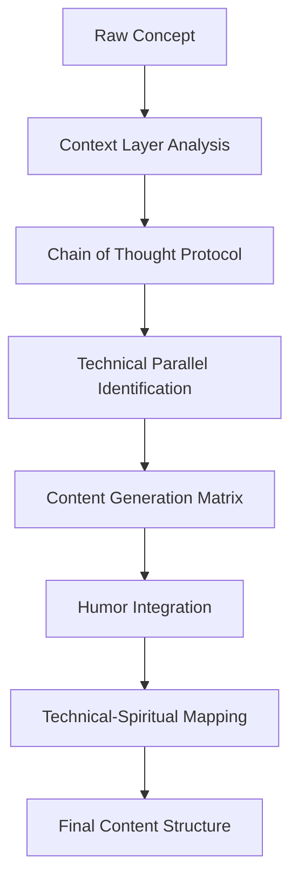
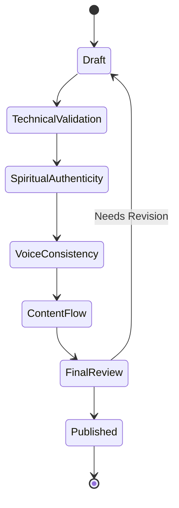

```mermaid
flowchart LR
    A1[Foundation Principles] --> A2[Technical-Spiritual Integration]
    A1 --> A3[Content Archetyping]
    A1 --> A4[Personality Layer]
    
    B1[Content Generation] --> B2[Structure Templates]
    B1 --> B3[Humor Matrix]
    B1 --> B4[Implementation Protocol]
    
    C1[Quality Control] --> C2[Validation Framework]
    C1 --> C3[Integration Protocol]
    C1 --> C4[Experience Optimization]```mermaid
sequenceDiagram
Alice->>John: Hello John, how are you?
John-->>Alice: Great!
Alice-)John: See you later!
```


```







