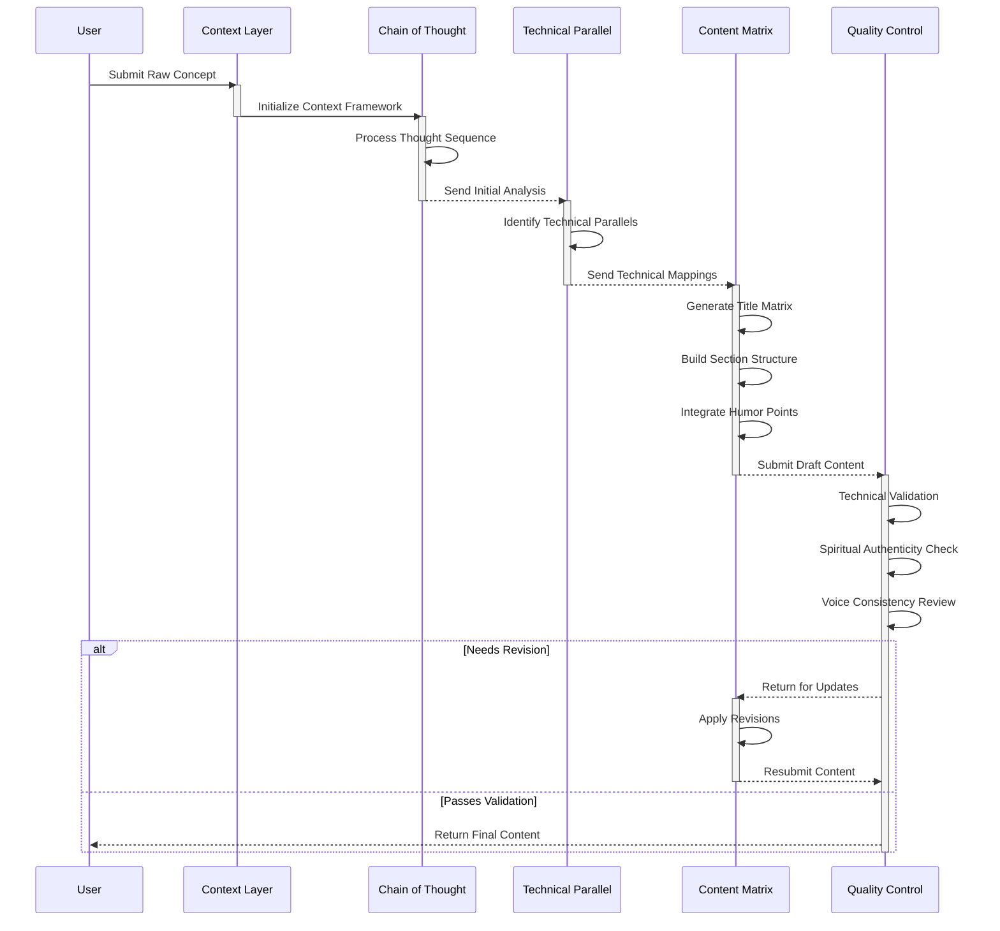

e

```mermaid
sequenceDiagram
    participant User
    participant Context as Context Layer
    participant Chain as Chain of Thought
    participant Tech as Technical Parallel
    participant Content as Content Matrix
    participant QC as Quality Control
    
    User->>Context: Submit Raw Concept
    activate Context
    Context->>Chain: Initialize Context Framework
    deactivate Context
    
    activate Chain
    Chain->>Chain: Process Thought Sequence
    Chain-->>Tech: Send Initial Analysis
    deactivate Chain
    
    activate Tech
    Tech->>Tech: Identify Technical Parallels
    Tech-->>Content: Send Technical Mappings
    deactivate Tech
    
    activate Content
    Content->>Content: Generate Title Matrix
    Content->>Content: Build Section Structure
    Content->>Content: Integrate Humor Points
    Content-->>QC: Submit Draft Content
    deactivate Content
    
    activate QC
    QC->>QC: Technical Validation
    QC->>QC: Spiritual Authenticity Check
    QC->>QC: Voice Consistency Review
    
    alt Needs Revision
        QC-->>Content: Return for Updates
        activate Content
        Content->>Content: Apply Revisions
        Content-->>QC: Resubmit Content
        deactivate Content
    else Passes Validation
        QC-->>User: Return Final Content
    end
    deactivate QC
```

``
