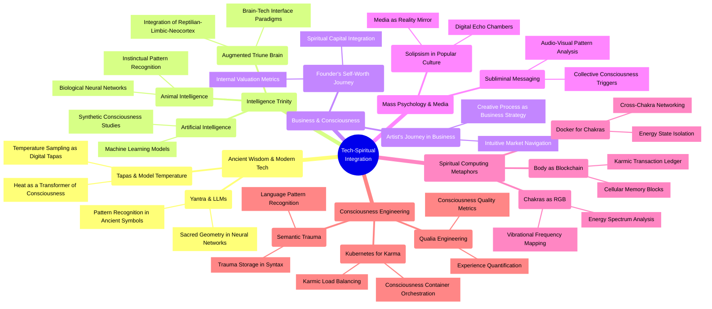

```mermaid
mindmap
  root((Tech-Spiritual
    Integration))
    (Ancient Wisdom & Modern Tech)
        (Yantra & LLMs)
            [Sacred Geometry in Neural Networks]
            [Pattern Recognition in Ancient Symbols]
        (Tapas & Model Temperature)
            [Heat as a Transformer of Consciousness]
            [Temperature Sampling as Digital Tapas]
    (Intelligence Trinity)
        (Animal Intelligence)
            [Instinctual Pattern Recognition]
            [Biological Neural Networks]
        (Augmented Triune Brain)
            [Integration of Reptilian-Limbic-Neocortex]
            [Brain-Tech Interface Paradigms]
        (Artificial Intelligence)
            [Machine Learning Models]
            [Synthetic Consciousness Studies]
    (Business & Consciousness)
        (Founder's Self-Worth Journey)
            [Internal Valuation Metrics]
            [Spiritual Capital Integration]
        (Artist's Journey in Business)
            [Creative Process as Business Strategy]
            [Intuitive Market Navigation]
    (Mass Psychology & Media)
        (Subliminal Messaging)
            [Audio-Visual Pattern Analysis]
            [Collective Consciousness Triggers]
        (Solipsism in Popular Culture)
            [Media as Reality Mirror]
            [Digital Echo Chambers]
    (Spiritual Computing Metaphors)
        (Docker for Chakras)
            [Energy State Isolation]
            [Cross-Chakra Networking]
        (Chakras as RGB)
            [Energy Spectrum Analysis]
            [Vibrational Frequency Mapping]
        (Body as Blockchain)
            [Cellular Memory Blocks]
            [Karmic Transaction Ledger]
    (Consciousness Engineering)
        (Kubernetes for Karma)
            [Karmic Load Balancing]
            [Consciousness Container Orchestration]
        (Semantic Trauma)
            [Language Pattern Recognition]
            [Trauma Storage in Syntax]
        (Qualia Engineering)
            [Experience Quantification]
            [Consciousness Quality Metrics]
```

