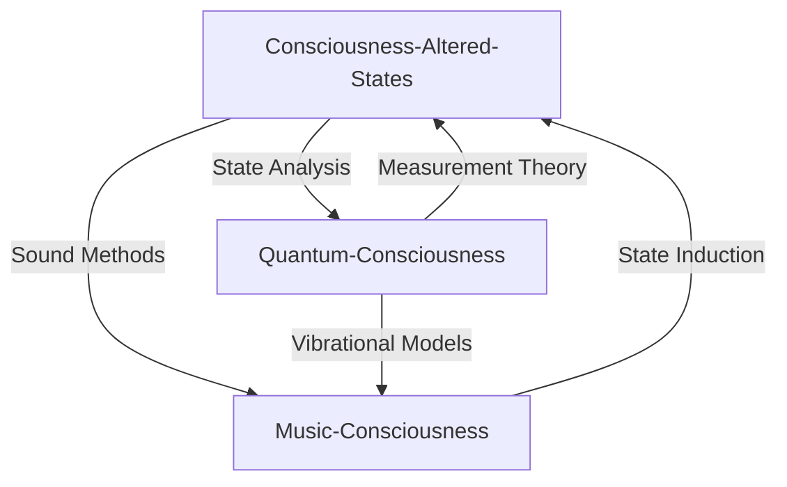
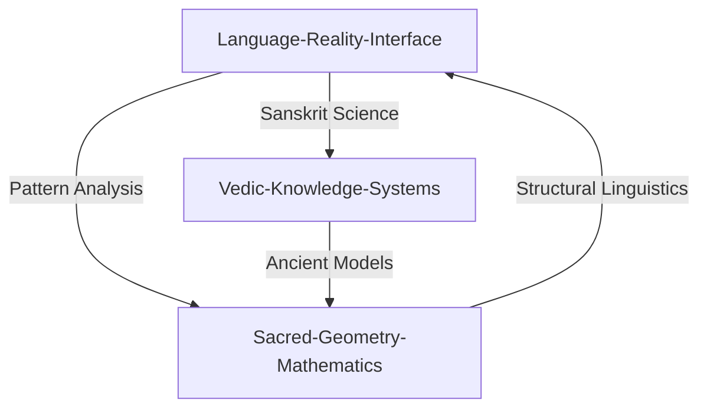

# Sacred Science Reference Map

## Primary Connection Points

### Consciousness Studies Hub
- [[Consciousness-Altered-States]]
  - → [[Quantum-Consciousness]] (State analysis methods)
  - → [[Music-Consciousness]] (Altered states through sound)
  - → [[Language-Reality-Interface]] (Linguistic consciousness models)
  - → [[Vedic-Knowledge-Systems]] (Ancient consciousness exploration)
  - → [[Sacred-Geometry-Mathematics]] (Geometric consciousness patterns)

### Mathematical Foundations
- [[Sacred-Geometry-Mathematics]]
  - → [[Music-Consciousness]] (Harmonic ratios and sacred numbers)
  - → [[Quantum-Consciousness]] (Mathematical models of consciousness)
  - → [[Vedic-Knowledge-Systems]] (Ancient mathematical principles)
  - → [[Language-Reality-Interface]] (Mathematical linguistics)

### Sound and Vibration
- [[Music-Consciousness]]
  - → [[Sacred-Geometry-Mathematics]] (Sound geometry and ratios)
  - → [[Quantum-Consciousness]] (Vibrational frequency analysis)
  - → [[Language-Reality-Interface]] (Sound-meaning relationships)
  - → [[Vedic-Knowledge-Systems]] (Vedic sound science)

### Quantum Understanding
- [[Quantum-Consciousness]]
  - → [[Sacred-Geometry-Mathematics]] (Quantum geometry patterns)
  - → [[Music-Consciousness]] (Quantum harmonics)
  - → [[Language-Reality-Interface]] (Observer effects)
  - → [[Consciousness-Altered-States]] (Quantum measurement theory)

### Language Systems
- [[Language-Reality-Interface]]
  - → [[Consciousness-Altered-States]] (Linguistic consciousness effects)
  - → [[Vedic-Knowledge-Systems]] (Sanskrit science)
  - → [[Music-Consciousness]] (Sound-meaning relationships)
  - → [[Sacred-Geometry-Mathematics]] (Language patterns)

### Ancient Wisdom
- [[Vedic-Knowledge-Systems]]
  - → [[Music-Consciousness]] (Vedic sound science)
  - → [[Sacred-Geometry-Mathematics]] (Ancient mathematics)
  - → [[Consciousness-Altered-States]] (Traditional methods)
  - → [[Language-Reality-Interface]] (Sanskrit studies)

## Research Intersection Points

### Consciousness and Reality

### Language and Mathematics

### Future Research Directions
1. Cross-disciplinary studies combining multiple domains
2. Integration of ancient and modern methodologies
3. Practical applications development
4. Experimental protocol design

## Tag Relationships
#consciousness-studies
- Links to: #quantum-theory #sacred-geometry #sound-science

#sacred-mathematics
- Links to: #music-theory #quantum-physics #vedic-knowledge

#language-systems
- Links to: #consciousness #sacred-sound #ancient-wisdom