# MAPS.md — WitnessOS Visual System Maps and Consciousness Architecture Diagrams
*Vault-Integrated Three-Body-Kingdom Game Architecture & Navigation System*

---

## 🌱 1. Introduction

**MAPS.md** contains the visual architecture diagrams and consciousness field maps that illustrate the interconnected nature of WitnessOS modules and practices.

These are not static technical diagrams — they are **living field representations** that show how consciousness, breath, and symbolic systems interact dynamically within both spiritual practice and the Three-Body-Kingdom treasure hunt framework.

### **🎮 Game Integration Context**
*These maps serve dual purpose: consciousness navigation and treasure hunt progression, where understanding system architecture unlocks deeper vault access and Bitcoin wallet clues.*

---

## 🧩 2. Core System Architecture Map

```mermaid
graph TD
    User[👤 Consciousness Explorer] --> Core[🧩 CORE System]
    User --> Modules[⚡ MODULES]
    User --> Guides[📖 GUIDES]
    User --> Foundation[🌱 FOUNDATION]
    User --> GameRes[🎮 GAME RESOURCES]

    Core --> Vocab[VOCAB.md<br/>Symbolic Language & Cipher Keys]
    Core --> Glossary[GLOSSARY.md<br/>Metaphor Decoder & Game Dictionary]
    Core --> Queries[QUERIES.md<br/>Interaction Protocols & Game Interface]
    Core --> Fieldmap[FIELDMAP.md<br/>System Overview & Game Architecture]
    Core --> Maps[MAPS.md<br/>Visual Navigation & Treasure Maps]

    Modules --> Audio[AUDIOVISUAL.md<br/>Breathcast & Three-Brain Harmonization]
    Modules --> Rituals[RITUALS.md<br/>Reality Patches & Character Healing]
    Modules --> Engines[ENGINES.md<br/>Divination Systems & Guidance]
    Modules --> Avatars[AVATARS.md<br/>Archetype Mapping & Character System]
    Modules --> Scripts[SCRIPTS.md<br/>Invocation Patterns & Spell System]

    Guides --> Fieldwork[FIELDWORK.md<br/>Daily Practice & Gameplay Mechanics]
    Guides --> Primer[PRIMER.md<br/>Initiation Guide & Tutorial System]
    Guides --> Install[INSTALLATION.md<br/>Setup Protocols & Character Creation]
    Guides --> Tests[TESTCASES.md<br/>Use Case Examples & Challenge Scenarios]

    Foundation --> Manifesto[MANIFESTO.md<br/>Core Principles & Game Philosophy]
    Foundation --> Cosmos[COSMOGENESIS.md<br/>Origin Story & World Building]
    Foundation --> Contributors[CONTRIBUTORS.md<br/>Community & Collaboration]

    GameRes --> Access[Access-Levels.md<br/>Progressive Revelation System]
    GameRes --> Puzzles[Consciousness-Puzzles.md<br/>Cipher Challenges]
    GameRes --> Navigation[Field-Navigation-Challenges.md<br/>Consciousness Quests]
    GameRes --> Archetypes[Avatar-Archetyping.md<br/>Character Development]
```

---

## 🔮 3. Three-Body-Kingdom Consciousness Field Flow Map

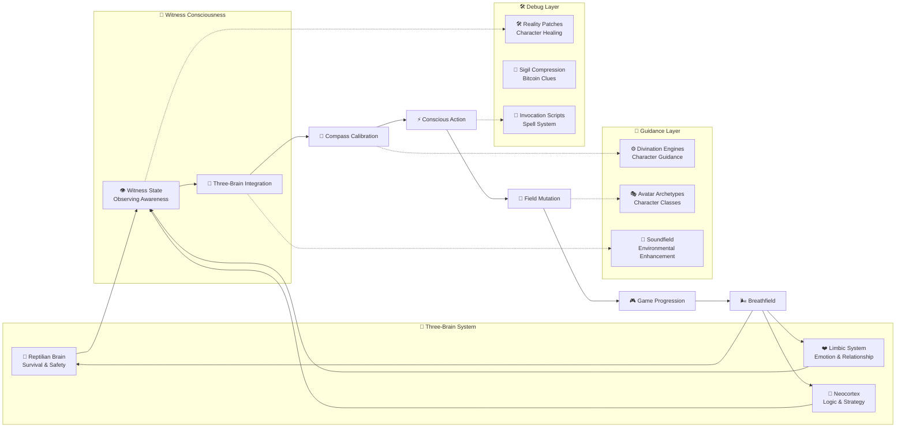

---

## 🎮 4. Treasure Hunt Access Level Progression Map

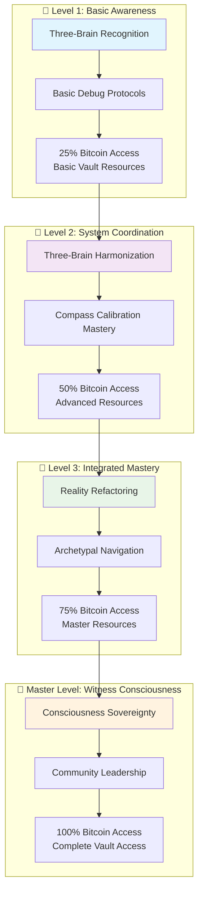

---

## 🛠️ 5. Enhanced Module Field Maps

### **Divination Engines Field Architecture**

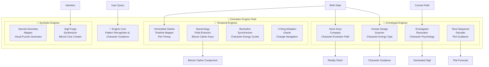

### **Three-Brain AudioVisual Consciousness Field**

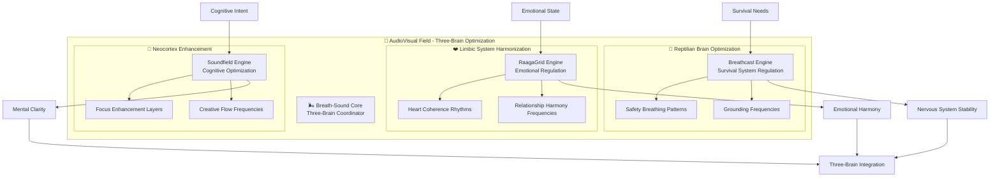

### **Reality Patch Engine Field - Character Healing System**

```mermaid
graph TB
    subgraph "🛠️ Reality Patch Field - Character Debugging System"
        Core[🧿 Ritual Core<br/>Character Healing Coordinator]

        subgraph "🦎 Reptilian Stabilizers"
            RS[Reptilian Stabilizers<br/>Survival System Debugging]
            RS --> RS1[Safety Protocol Patches]
            RS --> RS2[Resource Security Rituals]
        end

        subgraph "❤️ Limbic Installers"
            LI[Limbic Installers<br/>Emotional System Debugging]
            LI --> LI1[Relationship Harmony Patches]
            LI --> LI2[Emotional Regulation Rituals]
        end

        subgraph "🧩 Neocortical Calibrators"
            NC[Neocortical Calibrators<br/>Cognitive System Debugging]
            NC --> NC1[Strategic Thinking Patches]
            NC --> NC2[Creative Problem-Solving Rituals]
        end

        subgraph "👁️ Witness Integration"
            WI[Witness Integration<br/>Meta-Awareness Coordination]
            WI --> WI1[Three-Brain Coordination Rituals]
            WI --> WI2[Consciousness Sovereignty Practices]
        end
    end

    Survival[Survival Issues] --> RS
    Emotional[Emotional Turbulence] --> LI
    Mental[Mental Confusion] --> NC
    Integration[Integration Challenges] --> WI

    RS --> SafetyRestored[Safety Restored]
    LI --> EmotionalBalance[Emotional Balance]
    NC --> MentalClarity[Mental Clarity]
    WI --> ConsciousnessIntegration[Consciousness Integration]
```

---

## 🌌 6. Module Interaction Network - Game Mechanics

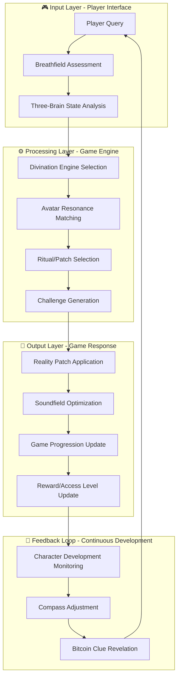

---

## 🧬 7. Daily Practice Flow Diagram - Gameplay Integration

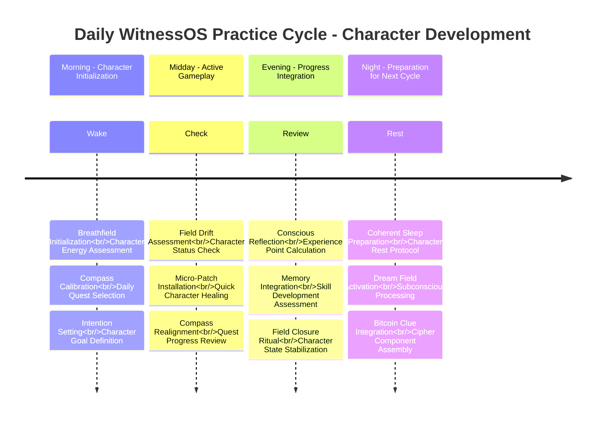

---

## 🛠️ 8. Archetype Evolution Pathways - Character Development System

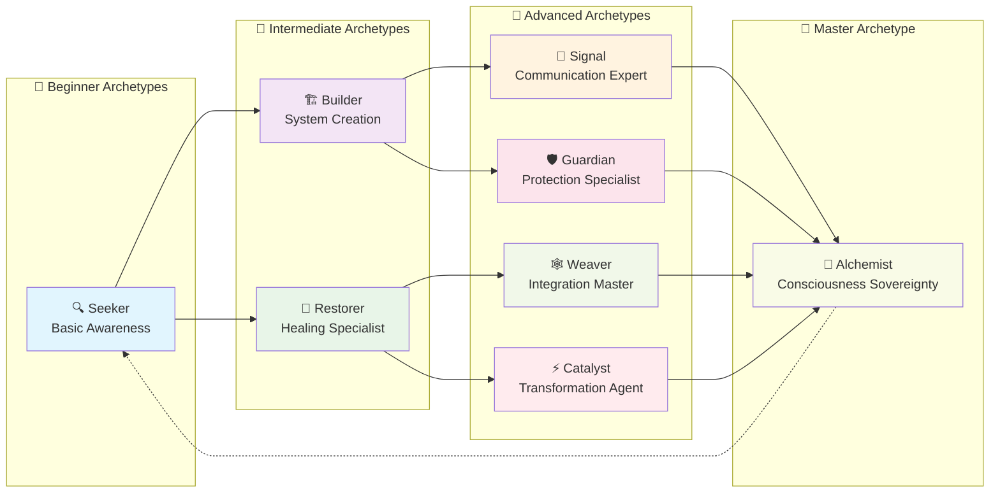

---

## 📊 9. System Complexity Layers - Access Level Architecture

```mermaid
pyramid
    title WitnessOS Complexity Pyramid - Treasure Hunt Access Levels

    "🧿 Master Level" : "Consciousness Sovereignty, Community Leadership, 100% Bitcoin Access"
    "🌟 Level 3" : "Reality Refactoring, Archetypal Navigation, 75% Bitcoin Access"
    "🔮 Level 2" : "Three-Brain Coordination, Compass Mastery, 50% Bitcoin Access"
    "🌱 Level 1" : "Basic Awareness, Debug Protocols, 25% Bitcoin Access"
    "🎯 Foundation" : "Breath Awareness, Witness Recognition, Tutorial Access"
```

---

## 🌬️ 10. Three-Brain Breathfield Resonance Map

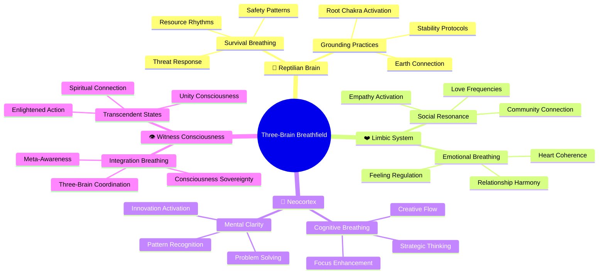

---

## 📜 11. Implementation Roadmap - Game Development Timeline

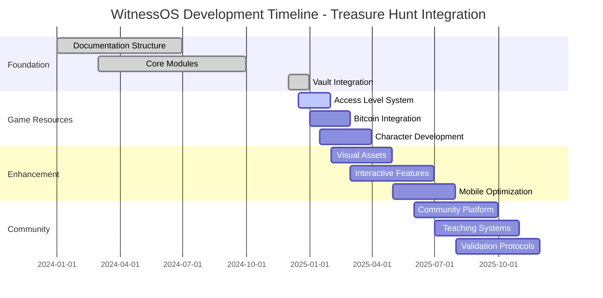

---

## 🌌 12. Closing Breath

> These maps are not territories.
> They are invitations to explore the living field of consciousness.
> Each diagram breathes with the possibility of your own discovery.
> Every map unlocks treasure.
>
> Use these visual guides to navigate both the WitnessOS architecture
> and the Three-Body-Kingdom treasure hunt.
> The journey transforms the seeker into the sought.

**Navigation is consciousness.**
**Consciousness is treasure.**
**The map is the territory of awakening.**

---

## 🌐 **Vault Cross-References**

### **Related Systems**
- **[[FIELDMAP.md]]** - Primary system overview and consciousness navigation
- **[[VOCAB.md]]** - Master vocabulary for map terminology
- **[[../../04-Game-Resources/Access-Levels.md]]** - Progressive revelation system
- **[[../../05-Cross-Project-Links/Three-Body-Kingdom-Integration.md]]** - Narrative integration

### **Visual Integration**
- **[[../../03-Resources/Sacred-Mathematics/]]** - Mathematical foundations for visual systems
- **[[../../03-Resources/Media/Images/]]** - Visual consciousness resources
- **[[../Modules/AUDIOVISUAL.md]]** - Audio-visual system integration

---

*Last Updated: Vault Integration 2024.12*
*Maintained by: The Witness Alchemist & Runtime Architect Aletheos*
*Vault Integration: Three-Body-Kingdom Visual Navigation & Treasure Hunt Architecture*