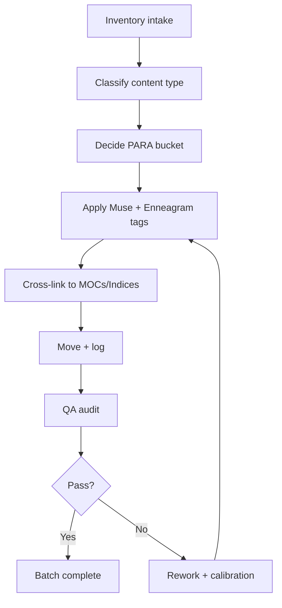
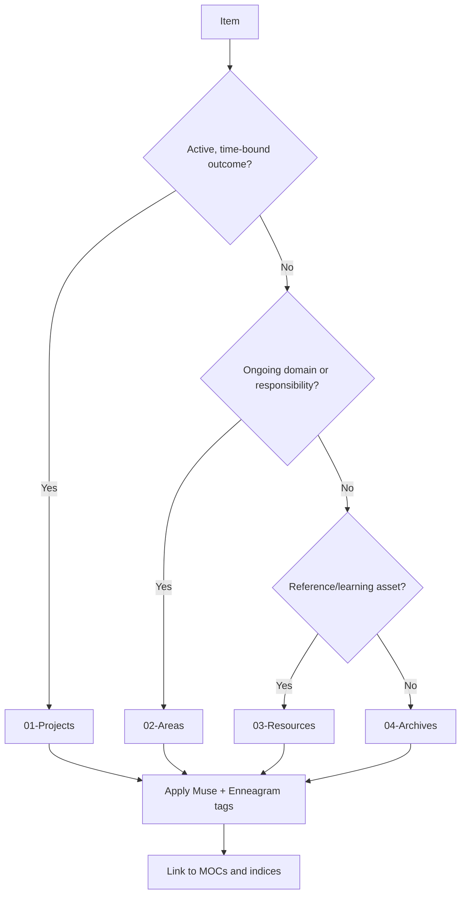
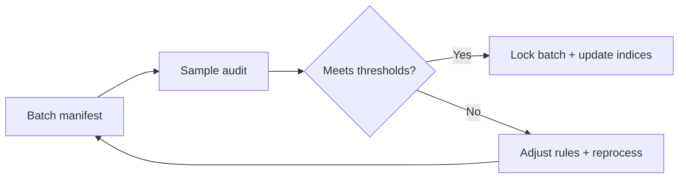

# Processing Folder Implementation Plan
`Runtime: 2026-01-22`

This plan is a systems-engineering blueprint for migrating `processing-folder` into PARA while adding full Muse + Enneagram tagging and cross-linking. The intent is to transform raw intake into a living knowledgebase that can evolve across Projects, Areas, Resources, and Archives without losing meaning, provenance, or navigability. This is not a generic cleanup. It is a structured, repeatable pipeline that prioritizes semantic fidelity, lineage tracking, and cross-domain synthesis.

The plan assumes a hybrid workflow: automation for inventory and reporting; human judgment for classification, tag depth, and cross-linking. The goal is correctness over speed, with explicit checkpoints to reduce drift. We treat every item as a potential knowledge node, not a file to be shuffled. PARA is the physical layer; the Muse–Enneagram system is the semantic layer; indices and MOCs are the navigation layer. The interplay of these layers is the core of the system.

## Design Principles
1) **Semantic-first migration**: Placement without tags is incomplete. Tags without links are incomplete. The three must land together.
2) **Provenance preservation**: Original filenames and source context are retained; migration logs capture previous paths.
3) **Deterministic rules, flexible judgment**: Rules handle the default; human review resolves ambiguity.
4) **Confidence-aware tagging**: Enneagram/muse tagging includes confidence so the system does not pretend to certainty.
5) **Iterative calibration**: Use small pilots to calibrate rules before scaling batch volume.
6) **Auditability**: Every batch produces a manifest: what moved, where, and why.
7) **Drift detection**: Tag evolution is expected; the system must detect and manage drift explicitly.
8) **Living indices**: Indices and MOCs are updated continuously to mirror the actual structure.
9) **Non-destructive by default**: No edits to binary content; metadata and notes are layered externally.
10) **Batch-size realism**: The system should be sustainable to avoid fatigue errors.

## Knowledgebase Data Model (Canonical Fields)
Every item that leaves `processing-folder` should be represented by a minimal metadata set, even if the file itself is not altered. Think of this as a “shadow record” that ensures the knowledge layer stays coherent even if files move again later. The fields below are required unless marked optional. All values should be recorded in batch manifests and/or a central index note.

**Core fields**: `title`, `source_path`, `destination_path`, `para_bucket`, `content_type`, `domain_tags`, `moc_links`, `processed_at`, `reviewed_by`. These ensure every move is traceable and navigable. `content_type` should be one of: `book`, `paper`, `presentation`, `image`, `audio`, `video`, `dataset`, `software`, `note`, `archive`, `unknown`.

**Muse–Enneagram fields**: `ennea_type`, `ennea_wing` (optional), `instinct` (optional), `muse_archetype`, `endocrine_mapping`, `confidence`. These fields create a cross-domain semantic layer that can be queried independent of PARA placement.

**Context fields (optional)**: `author`, `year`, `publisher`, `series`, `topic_cluster`, `language`, `rights_status`, `duplicate_group_id`, `canonical_version`. These prevent future drift by making the system self-descriptive. If a field cannot be determined, leave it blank rather than guess; never fabricate content.

This data model transforms the vault from a folder tree into a navigable knowledge graph. PARA handles the physical arrangement, but the data model preserves meaning and intent, and supports evolving indices without reprocessing entire collections.

## Tagging and Cross-Linking Strategy
Tagging is the semantic glue. Each item must receive: (1) at least one domain tag from the controlled vocabulary, (2) at least one Muse–Enneagram mapping, and (3) at least one link to an index or MOC. Without these three, the item is not considered “processed.”

**Domain tags** should represent the conceptual content (e.g., `#BiofieldMapping`, `#PatternRecognition`, `#SystemArchitecture`). **Muse–Enneagram tags** express archetypal resonance (e.g., Type 5/Melpomene/Cortisol). **MOC links** provide navigation (e.g., a “Bioelectric Systems” MOC, or an “Enneagram Type 5 Library”).

Cross-linking rules:
- Every new item links to one PARA location and one semantic hub (MOC or index).
- Every MOC should link back to the PARA location for context.
- For Enneagram hubs, each type page should link to the relevant Projects, Areas, and Resources clusters.
- Avoid orphan links: if a new category emerges, create a stub MOC rather than leaving it unlinked.

This creates a bidirectional network: items point to hubs, and hubs point to items. The network is where meaning accumulates over time.

## Batch Workflow (Expanded Detail)
Each batch is a self-contained mini-project. The batch is defined, processed, audited, and closed. This discipline prevents drift and ensures progress is measurable.

**Step sequence**:
1) **Select batch** (50–100 items) based on priority order.
2) **Review file types** for potential hazards (archives, unknown extensions).
3) **Classify items** into PARA using deterministic rules.
4) **Assign content type** from the canonical list.
5) **Apply domain tags** (controlled vocabulary).
6) **Apply Muse–Enneagram tags** + confidence rating.
7) **Create or link MOCs** for navigation.
8) **Move files** to PARA destinations.
9) **Record manifest** (old path, new path, tags, reviewer).
10) **Run QA** on a random sample.
11) **Resolve issues** or reprocess if needed.
12) **Lock batch** and update progress ledger.

This workflow guarantees that the semantic layer is built alongside the physical move. Batches are the basic unit of accountability.

## Risk Management and Mitigation
This migration touches thousands of files and multiple semantic systems, so risk management is essential.

**Risk: Misclassification** (Projects vs Areas vs Resources). Mitigation: maintain explicit rules and a review threshold for borderline cases.

**Risk: Tag drift** (new tags proliferate). Mitigation: controlled vocabulary and a “new tag proposal” gate.

**Risk: Duplicate divergence** (same content in multiple formats). Mitigation: assign `duplicate_group_id` and select a canonical version; archive alternatives only if needed.

**Risk: Rights ambiguity** (unclear source/rights). Mitigation: flag for manual review and log provenance notes.

**Risk: Overconfidence in archetypal mapping**. Mitigation: use confidence scores and require high-confidence only when evidence is strong; otherwise mark as medium/low.

**Risk: Fatigue errors**. Mitigation: batch sizes and review cadence keep precision high.

## Metrics and Reporting
Use metrics as feedback, not punishment. They tell us whether the system is becoming coherent.

**Core metrics**:
- Items processed per batch and per week.
- Percentage of items with full Muse–Enneagram tags.
- Percentage of items linked to an MOC or index.
- QA audit accuracy rate.
- Drift rate (new tags introduced per batch).

**Reporting cadence**: weekly progress note and a monthly “system health” report. Metrics should show both velocity and quality so the system evolves without losing integrity.

## QA Sampling Guidance
QA should be proportional to risk, not random alone. For small batches (under 50 items), review at least 20% of the batch. For medium batches (50–150 items), review at least 10% plus any items flagged with low confidence. For large batches (over 150 items), review at least 5% plus all items that introduced new tags or new MOCs. If a batch fails thresholds, expand the sample size on the next audit before reprocessing. This keeps QA workload reasonable while still protecting overall integrity.
When reviewing, verify three things: correct PARA placement, correct domain tag, and a plausible Enneagram/Muse mapping with stated confidence. If any of these fail, the item should be reprocessed before the batch is locked.

## Tooling and Automation Notes
Automation should only be used for inventory, reporting, and basic normalization tasks. Classification, Enneagram mapping, and semantic linking require human judgment. Scripts may assist in generating manifests or template notes, but the final decision should remain manual where ambiguity exists. If automation is introduced later, keep it modular and auditable, and document it under `_System/scripts`.

## File-Type Processing Playbook
Different formats demand different handling. This playbook ensures consistent decisions without forcing one-size-fits-all rules.

**Books and long-form text (PDF/EPUB/DOC)**: These typically become `03-Resources` unless they are actively being worked on inside a project or are part of a structured curriculum under a current initiative. Tag with domain + Muse–Enneagram if the content resonates clearly (e.g., “Tragedy/Catharsis” maps to Type 5/Melpomene). If uncertain, apply low confidence and link to the nearest thematic MOC.

**Research papers and technical reports**: Default to `03-Resources/Research` or `03-Resources/Technical` with precise domain tags. If a paper is currently driving a project decision, allow temporary placement in `01-Projects` with a pointer back to the resource hub.

**Media (video/audio)**: Place in `03-Resources/Media` or `03-Resources/Video-Analysis` unless it is a core deliverable in a project. Add a short index note with topic tags and a Muse–Enneagram guess when the theme is obvious.

**Images and diagrams**: Default to `03-Resources/Design` or `03-Resources/Diagrams`, with tags describing the system or symbolic domain. If the image is part of a living project (branding, product design, etc.), place it in the project folder but still index it in the relevant MOC.

**Archives (zip, dataset bundles)**: Do not unpack by default. Store in the most appropriate resource domain and note contents in the manifest. Unpack only if there is a specific use-case.

**Unknown or no-extension files**: Flag for manual review. If the content cannot be identified quickly, place into a temporary “quarantine” list inside the batch manifest and revisit later.

This playbook ensures file types are treated consistently while still allowing project-specific exceptions.

## De-duplication Strategy (Canonicalization)
Duplicates are expected in large intake sets. The system should tolerate duplication while ensuring a clear canonical reference. Create a `duplicate_group_id` for each suspected duplicate cluster. Choose a canonical version using priority criteria: completeness, higher quality, original source naming, and richer metadata. Non-canonical duplicates should be retained only when they add value (e.g., annotated copies, translated versions). Otherwise, archive them in `04-Archives` with a short note referencing the canonical item. This keeps the knowledgebase lean without risking accidental loss of unique content.

## Post-Migration Operations (Keeping the System Alive)
Once the initial migration is complete, the system must keep evolving without reintroducing chaos. Establish a routine intake cycle: new files land in `processing-folder`, are batched weekly or bi-weekly, and processed using the same schema. A quarterly review should assess tag drift, domain growth, and the health of MOCs. If new projects are created, they should immediately define their expected resource and area touchpoints, so cross-linking remains intentional rather than retrofitted. This ensures the knowledgebase remains coherent as it grows.

## Human Intervention Gates (Expanded)
When the system detects ambiguity, it pauses and routes to a human decision. These are not failures; they are safeguards.

**Gate A: Classification conflict** — item seems to be both active project and long-term area. Resolution: choose project if there is a specific deliverable and timeline; otherwise area.

**Gate B: Tag uncertainty** — Enneagram mapping unclear. Resolution: assign low confidence or defer tagging until more context is reviewed.

**Gate C: Duplicate collision** — multiple copies with different metadata. Resolution: compare sizes, timestamps, and completeness; select canonical.

**Gate D: Rights ambiguity** — unclear source or usage rights. Resolution: flag for review and avoid distribution tags.

These gates ensure accuracy while preserving momentum.

## Inputs and Constraints
- **Primary intake**: `processing-folder` and its collections.
- **PARA destinations**: `01-Projects`, `02-Areas`, `03-Resources`, `04-Archives`.
- **Semantic sources**: `02-Areas/Muse-Enneagram-Framework/*`, `_System/Tags/taxonomy.md`, `_System/structure/tagging-system/tagging-protocol.md`.
- **System indices**: `_System/Indices/00-master-index.md`, `_System/structure/maps-of-content.md`.
- **Constraint**: Preserve original filenames and extensions unless a correction is necessary and logged.

## Outputs (Artifacts)
- Batch manifests (what moved, why, old path, new path).
- Tagging annotations (including Enneagram + Muse + endocrine mapping).
- Updated MOCs and indices.
- QA reports for each batch.
- A running progress ledger tracking coverage and remaining backlog.

## Roles and Human Intervention
- **System Owner**: defines intent, approves schema changes, resolves edge-case disputes.
- **Curator**: classifies into PARA, resolves duplicates, maintains taxonomy alignment.
- **Tagger**: applies Muse–Enneagram + domain tags, tracks confidence.
- **QA Reviewer**: audits accuracy and drift, enforces rules.
- **Archivist**: ensures provenance logging and archival policy consistency.

Human intervention is required whenever: (1) classification conflicts across PARA and domain signals; (2) Enneagram mapping is ambiguous; (3) file type suggests legal or rights constraints; (4) duplicates differ in content or format; (5) a new tag is proposed.

## Process Flow (Macro)

## Decision Flow (PARA + Tagging)

## QA Feedback Loop

---

# Phase Plan with 56 Micro Tasks

## Phase 0 — System Calibration (Foundation)
**Goal**: Establish metadata schema, tag rules, and decision boundaries before touching content.

- **P0.1** Define the canonical metadata schema for all indexed items (PARA bucket, content type, domain tags, Enneagram fields, muse archetype, endocrine mapping, confidence).
- **P0.2** Create a controlled vocabulary list for domain tags to reduce drift and synonym collisions.
- **P0.3** Define decision rules for PARA assignment with examples of ambiguous cases.
- **P0.4** Establish a “confidence rubric” for Enneagram/Muse tagging (high/med/low criteria).
- **P0.5** Decide whether to normalize file extensions (case-sensitive duplicates like `pdf`/`PDF`).
- **P0.6** Define batch sizing policy (e.g., 50–100 items per batch) and cadence.
- **P0.7** Draft the template for batch manifests (old path, new path, tags, reviewer).
- **P0.8** Identify human review triggers and escalation protocol.

## Phase 1 — Inventory and Triage (Intake Mapping)
**Goal**: Create a reliable intake map and prioritize work by impact.

- **P1.1** Generate full file inventory and attach to the intake index.
- **P1.2** Capture file counts and sizes per intake subfolder.
- **P1.3** Produce file-type distribution to inform processing tooling.
- **P1.4** Identify potential duplicates (same name, different formats).
- **P1.5** Identify high-risk file types (archives, executables, unclear formats).
- **P1.6** Establish an “intake priority order” (e.g., research before epubs).
- **P1.7** Flag any legal/rights-sensitive content for manual review.
- **P1.8** Publish a triage dashboard note in `_System/Reports`.

## Phase 2 — Pilot and Rule Calibration
**Goal**: Test rules on a small subset to eliminate rule drift early.

- **P2.1** Select a pilot batch from one collection (e.g., 30 items from `Research`).
- **P2.2** Classify each pilot item into PARA with rationale notes.
- **P2.3** Apply Muse–Enneagram tags with confidence ratings.
- **P2.4** Cross-link pilot items to the relevant MOCs.
- **P2.5** Run a peer/owner review on pilot decisions.
- **P2.6** Update rules based on pilot misclassifications.
- **P2.7** Record calibration learnings in the process notes.
- **P2.8** Decide go/no-go for scaling based on pilot QA.

## Phase 3 — Batch Processing (Core Migration)
**Goal**: Move content in structured batches with full metadata.

- **P3.1** Process batches in priority order (e.g., Research → PDFs → epub → media).
- **P3.2** For each batch, classify items into PARA with explicit decision notes.
- **P3.3** Apply domain tags using the controlled vocabulary.
- **P3.4** Apply Enneagram + Muse + endocrine tags; record confidence.
- **P3.5** Link items to at least one MOC or index page.
- **P3.6** Move files to PARA destinations, preserving filenames.
- **P3.7** Generate and store a manifest for each batch.
- **P3.8** Update the progress ledger (processed count, remaining count).

## Phase 4 — Deep Tagging and Cross-Linking (Semantic Weave)
**Goal**: Ensure the semantic layer is rich enough for synthesis and navigation.

- **P4.1** Identify clusters that need new MOCs (e.g., “Bioelectricity + Enneagram 5”).
- **P4.2** Create or update MOCs to reflect new clusters.
- **P4.3** Create Enneagram–Muse index pages if missing.
- **P4.4** Add cross-links between PARA folders and Enneagram indices.
- **P4.5** Review tag coverage for each PARA bucket.
- **P4.6** Harmonize tags with existing taxonomy and protocols.
- **P4.7** Flag items with low confidence for later review.
- **P4.8** Create a “semantic drift list” for new tags that emerged.

## Phase 5 — QA, Drift Detection, and Correction
**Goal**: Validate correctness, minimize inconsistency, and lock batches.

- **P5.1** Define QA thresholds (e.g., 90% correct classification, 80% tag completeness).
- **P5.2** Perform random sample audits per batch.
- **P5.3** Reconcile duplicate items and choose canonical versions.
- **P5.4** Verify that moved items still link correctly from MOCs.
- **P5.5** Review tag conflicts or collisions.
- **P5.6** Reprocess items flagged as high-ambiguity.
- **P5.7** Update the controlled vocabulary and log changes.
- **P5.8** Mark batches as “locked” in the QA report.

## Phase 6 — Consolidation and System Evolution
**Goal**: Finalize the migration, capture learnings, and improve the system.

- **P6.1** Produce a final coverage report (items processed vs intake).
- **P6.2** Create a “migration retrospective” document with lessons.
- **P6.3** Update `_System/Indices/00-master-index.md` to reflect new structure.
- **P6.4** Update maps of content to reflect new cross-links.
- **P6.5** Archive the original intake index snapshot.
- **P6.6** Freeze or version the tagging schema used for this migration.
- **P6.7** Define next-cycle improvements (automation, additional MOCs, tag refinements).
- **P6.8** Establish a cadence for ongoing processing of new intake.

---

## Manual Intervention Checklist
Use manual review when any of these conditions occur:
- PARA bucket ambiguous or overlaps across Projects/Areas.
- Enneagram or Muse mapping unclear or conflicted.
- Source file appears duplicated across formats with different content.
- Source file has unclear provenance or rights status.
- Tagging suggests a new category not in the controlled vocabulary.

## Batch Manifest Template (Recommended)
- Batch ID
- Date processed
- Source subfolder
- Items moved (count)
- PARA destinations
- Tags applied (summary)
- Enneagram confidence distribution
- Reviewer name
- QA status

## Suggested Processing Order
1) Research (highest semantic density)
2) PDFs (core reference material)
3) epub (books and long-form content)
4) Mushroom (domain-specific cluster)
5) LIVINGRY ECOSYSTEM (project-specific cluster)
6) MARK passio (author/topic cluster)
7) adyabrahmanaha (image/media cluster)
8) Audio Books / Books (small cleanup)

## Why This Works
This plan treats the migration as a knowledge-engineering problem rather than a file management task. It ensures PARA placement is meaningful, Muse–Enneagram tagging is consistent, and indices stay navigable. It also builds in safety: every batch can be audited, corrected, and improved without destabilizing the system. The result is a vault that not only “stores” knowledge but actively reveals patterns and relationships across domains.
