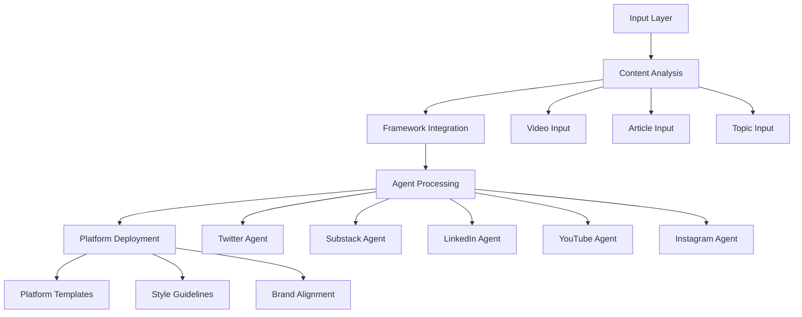
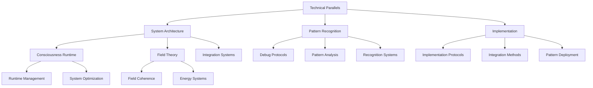
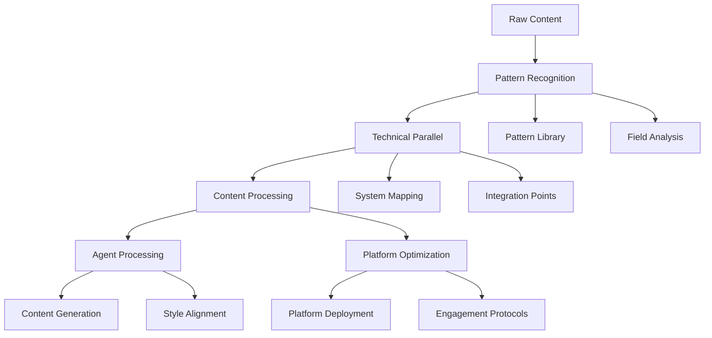
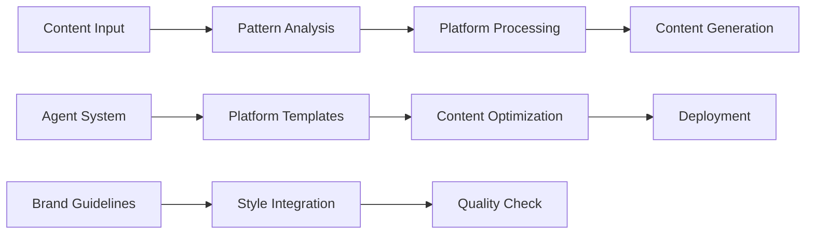
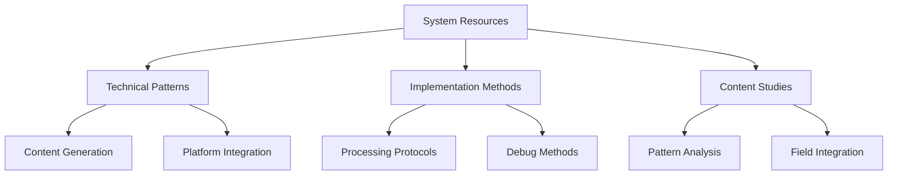
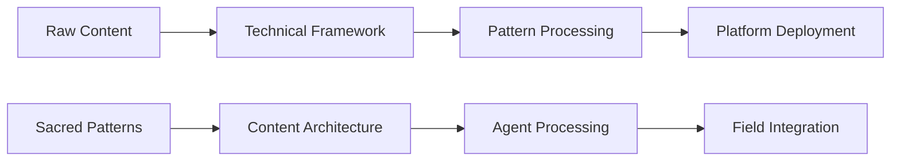

# Maps of Content (MOC)
`Version 2.2.0 | Pattern Runtime 2024-12-09`

## Content Processing Flow

## Core System Architecture

## Content Integration Flow

## Agent Processing Architecture

## Implementation Paths

### Content Processing Path
1. Raw Content → Pattern Recognition → System Integration
2. Technical Parallel → Content Processing → Platform Deployment
3. Analysis Protocol → Agent Processing → Content Generation

### Agent Implementation
1. Content Input → Pattern Analysis → Platform Generation
2. Brand Guidelines → Style Integration → Platform Deployment
3. Technical Framework → Content Optimization → Field Integration

### Resource Relationships

## Content Flow Architecture

## Implementation Notes

1. Content Processing Points
   - Raw content → Pattern analysis
   - Technical mapping → Content integration
   - Pattern recognition → Platform deployment
   - Agent processing → Field coherence

2. Integration Flows
   - Content input → System patterns
   - Technical parallels → Implementation methods
   - Ancient wisdom → Modern frameworks
   - Traditional systems → Platform protocols

Vault Navigation Schema

### Core Knowledge Domains

#### 1. Consciousness Architecture `#ConsciousnessMapping`
- Biofield Dynamics
- Pattern Recognition Protocols
- Energy System Optimization

#### 2. Technical-Spiritual Integration `#TechnicalMystic`
- Code as Consciousness Metaphors
- Runtime Awareness Protocols
- Systemic Wisdom Frameworks

#### 3. Experimental Frameworks `#EmergentStrategy`
- Innovative Research Protocols
- Adaptive Methodology Development
- Boundary-Pushing Investigations

## Content Type Taxonomy

### 1. Research Documents `#AnalyticalFramework`
- Theoretical Explorations
- Empirical Studies
- Conceptual Mappings

### 2. Implementation Guides `#ProtocolDevelopment`
- Practical Application Strategies
- Step-by-Step Transformation Protocols
- Deployment Methodologies

### 3. Reflective Archives `#InsightCuration`
- Personal Observations
- Emergent Pattern Documentation
- Thematic Reflections

## Interconnection Principles

### Linking Strategies
- Semantic Relationship Mapping
- Context-Aware Connections
- Dynamic Reference Evolution

### Knowledge Flow
- Horizontal Integration
- Vertical Depth Exploration
- Cross-Domain Pollination

## Navigation Recommendations

1. Use Contextual Tags
2. Follow Emergent Connections
3. Embrace Non-Linear Exploration
4. Maintain Adaptive Perspective

## Versioning & Maintenance

- Quarterly Structural Review
- Continuous Tag Refinement
- Adaptive Ontology Management

#VaultNavigation #KnowledgeTopology #ConsciousnessMapping

## Changelog

### 2024-12-09 (Version 2.2.0)
- Added Content Processing Flow diagram
- Added Agent Processing Architecture
- Enhanced Implementation Paths
- Added Content Integration Flow
- Updated all existing maps with new relationships

Last Update: 2024-12-09
Runtime Version: 2.2.0