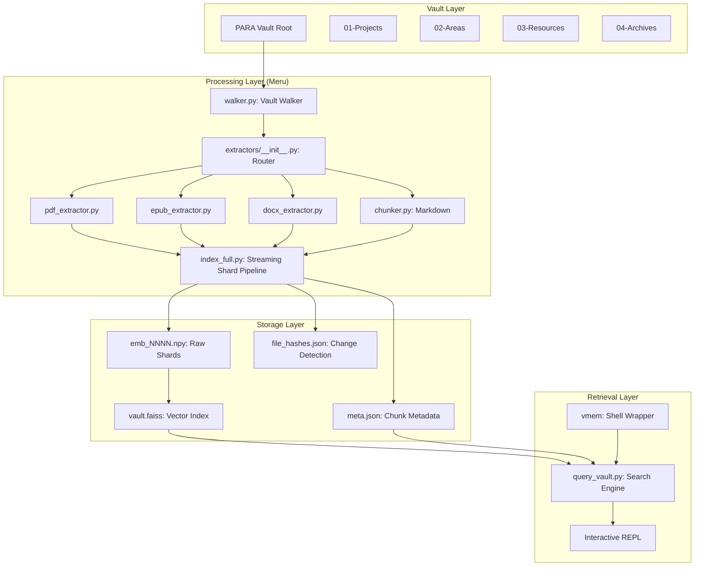

# Meru: Local Memory Architecture

Meru is the semantic indexing and retrieval layer of the TWC Vault. It provides a "High-Prana" context for AI agents by transforming the static vault content (Markdown, PDF, EPUB, DOCX) into a queryable vector space.

## 🏗️ System Design

## 🌊 Execution Roadmap (Phase B)

| Wave | Focus | Status | Deliverables |
|---|---|---|---|
| **B-W1** | Infrastructure | ✅ Done | ExtractedDoc dataclass, shared deps |
| **B-W2** | PDF Pipeline | ✅ Done | PyMuPDF extractor, quality scorer |
| **B-W3** | EPUB Pipeline | ✅ Done | ebooklib extractor, HTML cleaner |
| **B-W4** | DOCX Pipeline | ✅ Done | python-docx extractor |
| **B-W5** | Unified Router | ✅ Done | extractors/__init__.py, format router |
| **B-W6** | Batch System | ✅ Done | Checkpoint/resume logic, memory monitor |
| **B-W7** | Full Indexer | ⚠️ WIP | Shard-based streaming pipeline |
| **B-W8** | Quality/Dedup | 📅 Next | SHA-256 deduplication, TOC filtering |
| **B-W9** | Query Features | 📅 Next | JSON output, format filtering |
| **B-W10** | Maintenance | 📅 Next | Health check, shell alias (vmem) |

## 🧩 Minimal Integration Strategy

Meru is designed for **Zero-Touch Integration**:
- **Sideloaded Index:** All index data resides in `_System/memory/`. It does not pollute project folders with hidden index files.
- **Read-Only Walker:** The system never modifies vault content. It strictly reads and transforms.
- **Virtual Memory Alias:** The `vmem` tool acts as a "virtual memory" access point, making the entire 54GB corpus available to the user via simple semantic queries.
- **Taxonomy Alignment:** Chunks are tagged with PARA buckets and Domains inferred from `_System/TAXONOMY-REFERENCE.md`, ensuring semantic continuity with the rest of the system.

## 💾 Resource Management

Due to the 54GB corpus size (~5.6M potential chunks), the system employs **Shard-Based Streaming**:
1. **Extraction:** 500 files are extracted/chunked in-memory.
2. **Encoding:** Chunks are encoded via `all-MiniLM-L6-v2`.
3. **Persistence:** Shard is saved to disk immediately.
4. **Flush:** Memory is cleared before the next batch.
5. **Assembly:** FAISS index is built incrementally from on-disk shards.

Peak RAM usage is maintained under **2GB**, regardless of total corpus size.
